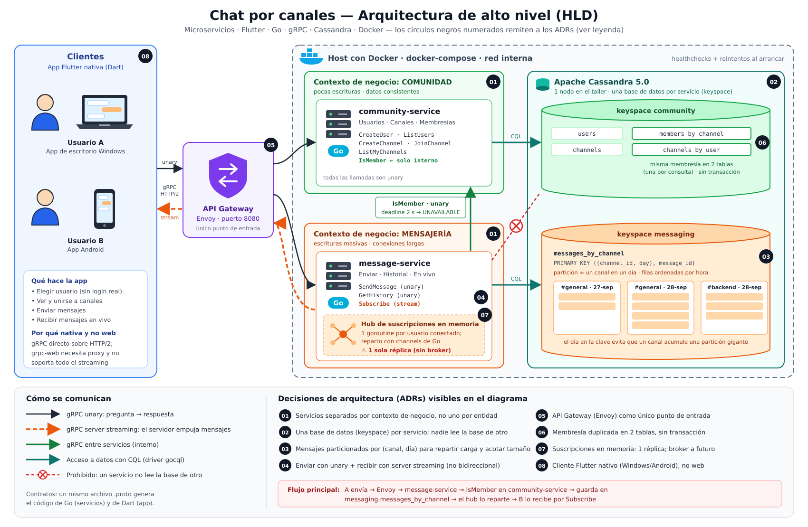

# Chat por canales — Microservicios con Flutter, Go, gRPC y Cassandra

Taller 01 de Arquitectura de Software. Un chat por canales construido para **mostrar el estilo de microservicios**: dos servicios separados por contexto de negocio, cada uno con su propia base de datos, un API Gateway como único punto de entrada y mensajes en vivo por gRPC server streaming.



**Guía de arquitectura:** [`docs/ARQUITECTURA.md`](docs/ARQUITECTURA.md). Explica el orden de arranque y de lectura, los componentes, dónde vive cada decisión en el código, el flujo con logs reales y la demo en 3 actos.

## Tecnologías

| Capa | Tecnología | Rol |
|---|---|---|
| Frontend | Flutter / Dart | App nativa para Windows y Android (`frontend/`) |
| Backend | Go 1.24 | `community-service` y `message-service` (`services/`) |
| Integración | gRPC + Protocol Buffers | Contratos en `proto/`; unary + server streaming |
| Persistencia | Apache Cassandra 5.0 | Un keyspace por servicio (`community`, `messaging`) |
| API Gateway | Envoy 1.31 | Único punto de entrada, `localhost:8080` |
| Contenedores | Docker + Docker Compose | Todo el backend con un comando |

| Servicio | Responsabilidad | Puerto |
|---|---|---|
| `community-service` | Usuarios, canales, membresías; responde `IsMember` | `50051` (interno) |
| `message-service` | Enviar, historial del día y suscripción en vivo | `50052` (interno) |
| `envoy` | Enruta cada llamada gRPC a su servicio | **`8080` (único publicado)** |
| `cassandra` | Persistencia | `9042` (interno) |

## Estructura

```text
proto/                        contratos gRPC (fuente única de verdad)
  community/v1/  messaging/v1/
  go/                         módulo Go; el código se genera al compilar
services/
  community-service/          servidor gRPC + Cassandra (keyspace community)
  message-service/            internal/{server,validation,membership,storage,hub,logging}
frontend/                     app Flutter; lib/src/{grpc,features,generated}
infra/
  cassandra/schema.cql        keyspaces y tablas
  cassandra/seed.cql          datos de demostración
  envoy/envoy.yaml            rutas del gateway y access log
scripts/                      gen-proto, smoke test y demo
docs/                         ARQUITECTURA.md y diagramas
docker-compose.yml
```

## Despliegue

### Requisitos

- Docker Engine y Docker Compose v2.
- Flutter (canal stable) para correr la app.
- Solo para desarrollo o pruebas: Go, `protoc`, `grpcurl` y `jq`. El backend **no** los necesita para levantarse: los Dockerfile generan el código de los contratos al compilar.

En Windows, los scripts se ejecutan desde WSL o Git Bash.

### 1. Levantar el backend

```bash
docker compose up -d --build
docker compose ps
```

El primer arranque de Cassandra tarda de 1 a 2 minutos. Cuando `cassandra-init` termina (`Exited (0)`), los servicios arrancan y Envoy queda escuchando en `localhost:8080`.

Para detener conservando los datos: `docker compose down`. Para empezar desde cero: `docker compose down -v`.

### 2. Correr la app

```bash
cd frontend
flutter pub get
flutter run -d windows                          # escritorio: se conecta a localhost:8080
flutter run -d emulator-5554                    # emulador Android: se conecta a 10.0.2.2:8080
flutter run -d <celular> --dart-define=HOST=192.168.x.x   # celular físico en la misma red
```

Compilar para Windows requiere Visual Studio con "Desktop development with C++".

### 3. Datos de demostración

| Usuario | ID | Canales |
|---|---|---|
| alice | `11111111-1111-4111-8111-111111111111` | #general, #backend |
| bob | `22222222-2222-4222-8222-222222222222` | #general |

Canales: #general (`aaaaaaaa-aaaa-4aaa-8aaa-aaaaaaaaaaaa`) y #backend (`bbbbbbbb-bbbb-4bbb-8bbb-bbbbbbbbbbbb`). Si bob escribe en #backend, recibe `PERMISSION_DENIED`.

## Pruebas

```bash
# Unitarias de message-service (validación, servidor con dobles en memoria, hub con -race)
cd services/message-service && go test -race ./...

# App: traducción de errores
cd frontend && flutter test

# Smoke test de punta a punta a través de Envoy (con el sistema levantado)
bash scripts/smoke.sh
```

El smoke test recorre todos los RPC y comprueba `ALREADY_EXISTS`, `INVALID_ARGUMENT`, `PERMISSION_DENIED` y la recepción en vivo por `Subscribe`.

## Demo en 3 actos

1. **Funciona:** dos apps en #general; lo que escribe una aparece en vivo en la otra.
2. **Fallo parcial:** `bash scripts/demo-acto2.sh`. Sin `community-service`, enviar falla con `UNAVAILABLE`, pero el historial sigue.
3. **Escalar y romper:** `bash scripts/demo-acto3.sh`. Con 2 réplicas de `message-service`, parte de los mensajes no llega en vivo, porque cada réplica tiene su propio hub en memoria.

Detalle y logs de cada acto en [`docs/ARQUITECTURA.md`](docs/ARQUITECTURA.md#7-demo-en-3-actos).

## API gRPC

`community.v1.CommunityService`:
- `CreateUser`, `GetUser`, `ListUsers`;
- `CreateChannel`, `GetChannel`, `ListChannels`;
- `JoinChannel`, `ListMyChannels`;
- `IsMember`: interna, la usa `message-service`.

`messaging.v1.MessagingService`:
- `SendMessage`: valida la entrada y la membresía, guarda y publica;
- `GetHistory`: mensajes del día actual (UTC) en orden cronológico; límite de 1 a 100, 50 por defecto;
- `Subscribe`: server streaming de los mensajes nuevos del canal.

Ejemplo a través de Envoy:

```bash
grpcurl -plaintext -import-path proto -proto community/v1/community.proto \
  localhost:8080 community.v1.CommunityService/ListChannels
```

Para regenerar el código de los contratos (Go en `proto/go`, Dart en `frontend/lib/src/generated`): `bash scripts/gen-proto.sh`.

## Configuración y observabilidad

- **Variables de los servicios:**
  - `CASSANDRA_HOSTS` (lista separada por comas);
  - `CASSANDRA_PORT` (`9042`);
  - `GRPC_PORT`;
  - `COMMUNITY_SERVICE_ADDR` (`community-service:50051`);
  - `LOG_LEVEL` (`debug` para más detalle).
- **Logs en JSON.** Envoy genera un `x-request-id` por petición y `message-service` lo propaga a `community-service`, así que un mismo id recorre toda la arquitectura:

```bash
docker compose logs -f --no-log-prefix envoy community-service message-service
```

## Fuera de alcance

- autenticación real (el usuario se elige de una lista; la lectura de canales es abierta);
- mensajes no leídos, búsqueda y presencia;
- edición o borrado de mensajes, adjuntos;
- historial de más de un día;
- notificaciones push;
- más de un nodo de Cassandra;
- más de una réplica de `message-service` (requiere un broker);
- Kubernetes.
