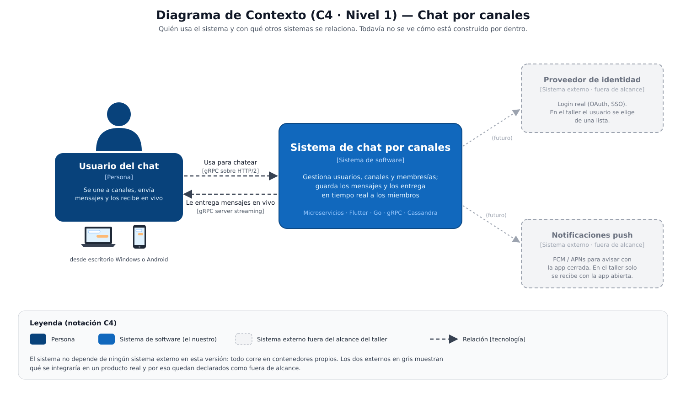
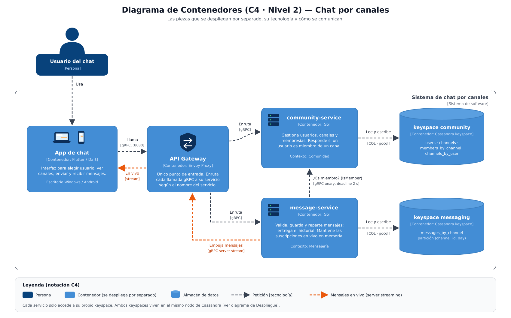
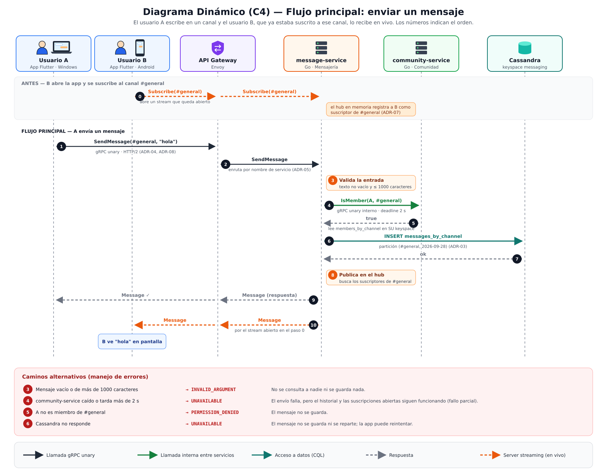
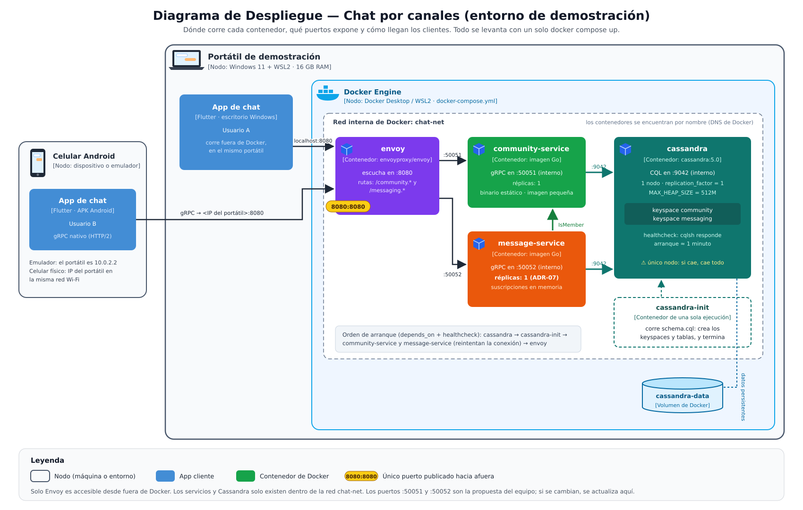
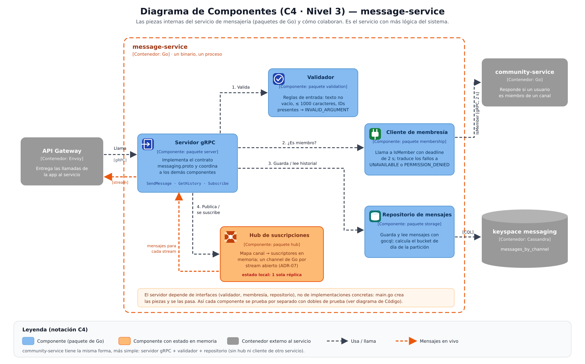
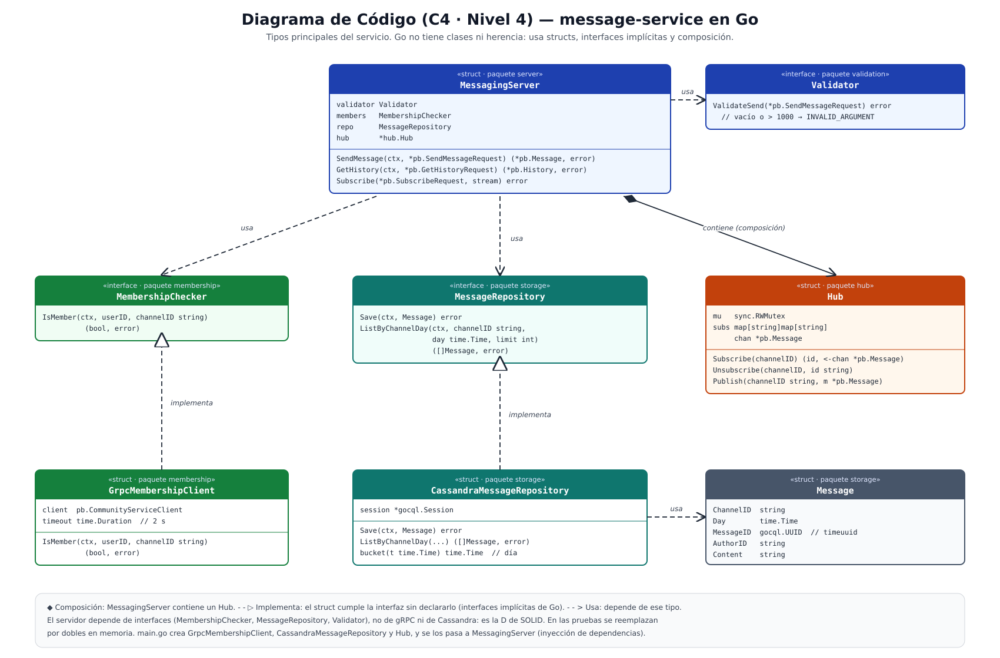
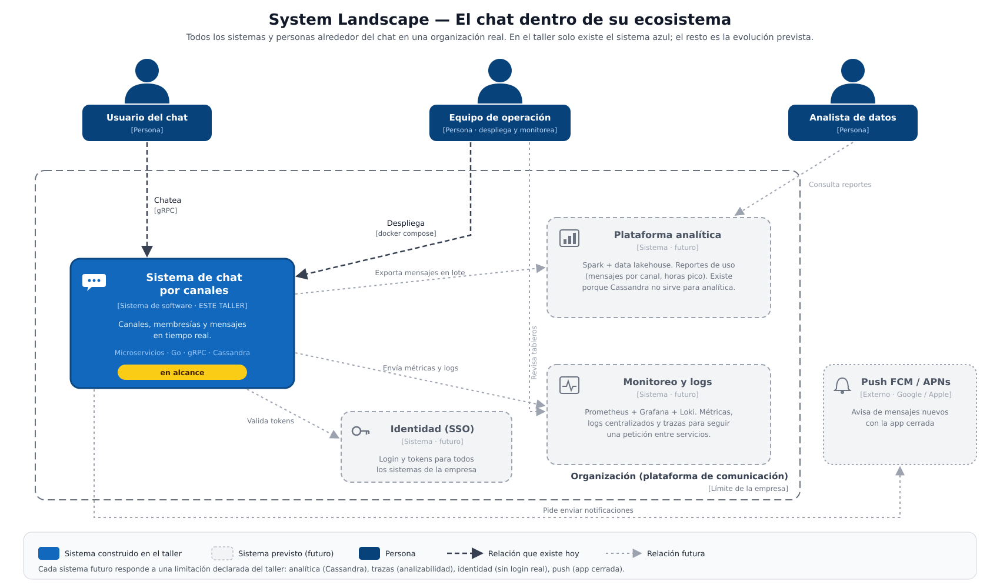
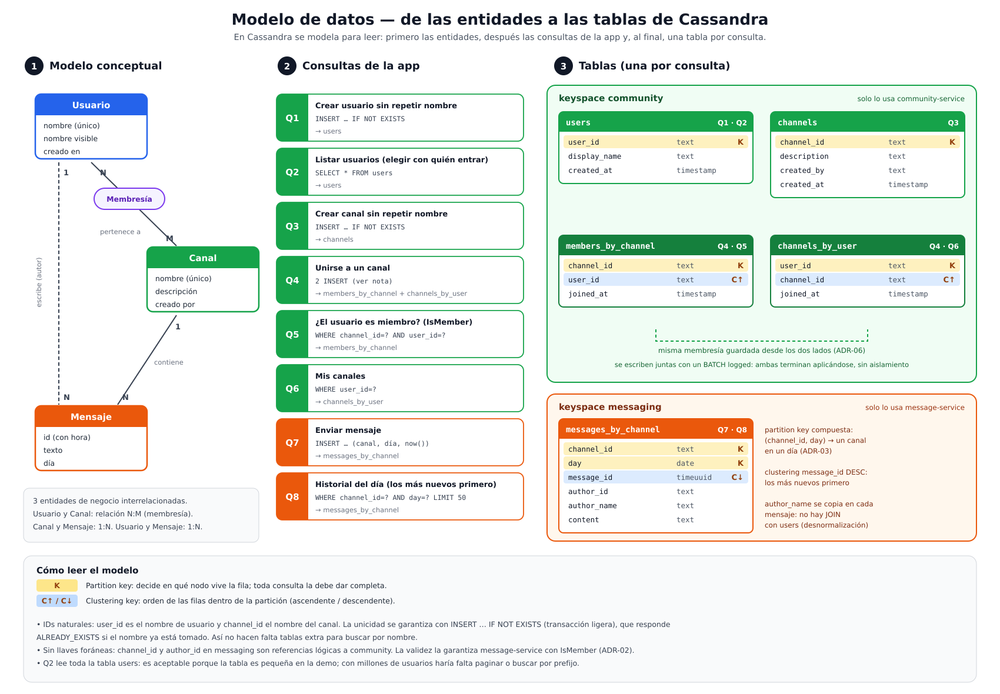

# Documento técnico — Taller 01: Chat por canales con microservicios

**Materia:** Arquitectura de Software · 8vo semestre
**Integrantes:** Angie Bautista, Miguel Laiton y Sebastián Sánchez
**Stack:** Flutter/Dart · Go · Apache Cassandra · gRPC

---

## 1. Investigación del estilo y stack

### 1.1 Estilo arquitectónico: microservicios

#### 1.1.1 Definición

**Qué es.** Los microservicios son un estilo arquitectónico en el que una aplicación se construye como un conjunto de **servicios pequeños y autónomos**. Cada servicio:
- corre en su propio proceso;
- se comunica con los demás por mecanismos ligeros (HTTP/REST, gRPC, mensajería);
- se organiza alrededor de una **capacidad de negocio**;
- se despliega de forma independiente [1][2].

Cada servicio es dueño de sus datos y puede estar escrito en un lenguaje distinto y usar una base de datos distinta.

**Qué no es.**
- **No es "partir el sistema en muchos contenedores".** Si los servicios comparten base de datos o hay que desplegarlos juntos, es un *monolito distribuido*: tiene los costos de un sistema distribuido y ninguna de sus ventajas.
- **No es SOA con otro nombre.** SOA busca reutilizar servicios empresariales a través de un bus central (ESB) con lógica de integración. Los microservicios ponen la inteligencia en los servicios y usan canales simples: *smart endpoints and dumb pipes* [1].
- **No es un tamaño de código.** "Micro" no significa pocas líneas, sino una responsabilidad acotada a un contexto de negocio.
- **No es la arquitectura por defecto.** Tiene un costo operativo alto que solo se justifica con ciertos problemas (ver 1.1.8).

#### 1.1.2 Clasificación del estilo

| Criterio | Clasificación |
|---|---|
| Topología | **Distribuido**: varias unidades desplegables que se comunican por red |
| Partición | **Por dominio**: los componentes se separan por capacidad de negocio, no por capas técnicas [3] |
| Familia | Arquitecturas orientadas a servicios, junto con SOA y la arquitectura basada en servicios (*service-based*) [3] |
| Cuantos arquitectónicos | Muchos: cada servicio con su base de datos es un cuanto que se despliega por separado [3] |

Comparado con estilos cercanos:
- **Monolito en capas:** una sola unidad desplegable, partida por capas técnicas.
- **Monolito modular:** una sola unidad desplegable, partida por dominio.
- **Arquitectura basada en servicios:** pocos servicios grandes que suelen compartir la base de datos.
- **SOA:** servicios empresariales orquestados por un bus central (ESB).
- **Microservicios:** muchos servicios pequeños, cada uno con sus datos, coreografiados o comunicados punto a punto.

#### 1.1.3 Características principales

Lewis y Fowler describen nueve características comunes [1]:

1. **Componentización mediante servicios:** el componente es un servicio que se despliega solo, no una librería.
2. **Organización por capacidades de negocio:** equipos multifuncionales por dominio, en línea con la ley de Conway.
3. **Productos, no proyectos:** el equipo que construye un servicio lo opera ("you build it, you run it").
4. **Endpoints inteligentes, canales simples:** la lógica vive en los servicios, no en el middleware.
5. **Gobierno descentralizado:** cada servicio elige su tecnología.
6. **Gestión de datos descentralizada:** base de datos por servicio y persistencia políglota.
7. **Automatización de la infraestructura:** CI/CD, contenedores, orquestación.
8. **Diseño para el fallo:** cualquier servicio puede caerse, y el resto debe tolerarlo.
9. **Diseño evolutivo:** los servicios se reemplazan o reescriben por separado.

#### 1.1.4 Historia y evolución

| Época | Hito |
|---|---|
| 1968 | Ley de Conway: los sistemas reflejan la estructura de comunicación de la organización que los diseña |
| Años 2000 | SOA y los *web services* (SOAP, WSDL, ESB) popularizan la idea de servicios, pero con buses centrales pesados |
| ~2002 | Amazon exige que todos sus equipos se comuniquen solo por interfaces de servicio, como antecedente de la organización por servicios |
| 2008–2016 | Netflix migra de un monolito en su propio datacenter a cientos de servicios en AWS, y publica herramientas como Eureka, Hystrix y Zuul [7] |
| 2011–2012 | Se acuña el término "microservicios" en talleres de arquitectos de software |
| 2014 | Lewis y Fowler publican "Microservices" y el término se vuelve de uso general [1] |
| 2014–2018 | Docker (2013) y Kubernetes (2014) abaratan desplegar muchos servicios, y la adopción se dispara |
| 2015 / 2021 | Sam Newman publica *Building Microservices* (1.ª y 2.ª edición) [2] |
| 2017–hoy | Service mesh (Istio, Linkerd), gRPC y observabilidad distribuida (OpenTelemetry) |
| 2018–hoy | **Corrección del péndulo:** empresas que reducen o revierten microservicios. Segment vuelve a un monolito (2018) [6], Uber agrupa servicios por dominio con DOMA (2020) [8] y Amazon Prime Video pasa un sistema de monitoreo a monolito con un 90 % menos de costo (2023) [5]. Gana fuerza el **monolito modular** como punto de partida |

#### 1.1.5 Ventajas y desventajas

| Ventajas | Desventajas |
|---|---|
| **Escalado independiente:** se escala solo el servicio con carga | **Complejidad operativa:** despliegue, monitoreo y depuración de muchos procesos |
| **Despliegue independiente:** ciclos de entrega cortos y de bajo riesgo | **Red no confiable:** latencia, fallos parciales, timeouts |
| **Aislamiento de fallos:** un servicio caído no tumba todo | **Consistencia eventual:** no hay transacciones ACID entre servicios |
| **Autonomía de equipos:** alineados a dominios (ley de Conway) | **Pruebas de integración** más difíciles |
| **Libertad tecnológica:** la herramienta adecuada para cada servicio | **Duplicación** de datos y de código de infraestructura |
| **Mantenibilidad:** bases de código pequeñas y enfocadas | **Costo:** más infraestructura y más personas para operar |
| **Evolución:** reescribir un servicio sin tocar los demás | **Diseño difícil:** una mala división crea acoplamiento distribuido |

#### 1.1.6 Problemas comunes y patrones que los resuelven

| Problema común | Patrón | Descripción breve |
|---|---|---|
| El cliente debe conocer y llamar a muchos servicios | **API Gateway** | Punto único de entrada que enruta, agrega y aplica políticas transversales [4] |
| Servicios que comparten tablas y quedan acoplados | **Base de datos por servicio** | Cada servicio es dueño exclusivo de sus datos [4] |
| Transacciones que abarcan varios servicios | **Saga** | Secuencia de transacciones locales con acciones compensatorias [4] |
| Consultas que cruzan datos de varios servicios | **API Composition / CQRS** | Componer respuestas o mantener vistas de lectura separadas [4] |
| Fallos en cascada por un servicio lento | **Timeout, Retry, Circuit Breaker, Bulkhead** | Limitar la espera, reintentar con control y cortar llamadas a un servicio que falla |
| Saber dónde está cada instancia | **Service Discovery** | Registro dinámico de instancias (DNS de Docker/Kubernetes, Consul, Eureka) |
| Rastrear una petición entre servicios | **Distributed Tracing + Log Aggregation** | ID de correlación, OpenTelemetry, logs centralizados |
| Mal particionamiento (un servicio por entidad) | **Descomposición por capacidad de negocio / subdominio (DDD)** | Separar por contextos acotados, no por tablas [2][4] |
| Contratos que se rompen entre versiones | **Contract-first / Consumer-Driven Contracts** | Contratos versionados (OpenAPI, Protobuf) y pruebas de contrato |
| Publicar eventos y guardar datos sin inconsistencias | **Transactional Outbox** | Guardar el evento en la misma transacción local y publicarlo después [4] |
| Migrar un monolito existente | **Strangler Fig** | Reemplazar funcionalidades de a poco, detrás de una fachada |

#### 1.1.7 Patrones aplicables y cuándo usarlos

| Patrón | Cuándo usarlo | Cuándo no |
|---|---|---|
| API Gateway | Hay clientes externos (móvil/web) y varios servicios | Un solo servicio, o solo tráfico interno entre servicios |
| Base de datos por servicio | Siempre que se quiera autonomía real entre servicios | Nunca es opcional en microservicios "de verdad" |
| Saga | Una operación de negocio modifica datos de varios servicios | Si la operación cabe en un solo servicio, mejor rediseñar los límites |
| CQRS | Lecturas y escrituras con cargas o modelos muy distintos | CRUD simple: agrega complejidad sin beneficio |
| Circuit Breaker | Llamadas síncronas a dependencias que pueden fallar o ponerse lentas | Llamadas locales o asíncronas por cola |
| Event-driven / Pub-Sub | Varios servicios reaccionan al mismo hecho; se quiere desacoplar en el tiempo | Se necesita respuesta inmediata y consistente |
| Strangler Fig | Migrar un monolito en producción sin reescribirlo todo | Proyectos nuevos |
| Service Mesh | Decenas de servicios con necesidades de mTLS, tráfico y observabilidad | Pocos servicios: el costo supera el beneficio |

#### 1.1.8 Casos de uso

**Cuándo usarlo:**
- Dominios grandes con **subdominios claros** que evolucionan a ritmos distintos.
- **Varios equipos** que necesitan desplegar sin coordinarse entre sí.
- Partes del sistema con **cargas muy distintas** que conviene escalar por separado
- Requisitos altos de **disponibilidad**, donde un fallo parcial es aceptable pero uno total no.
- Organizaciones con madurez en **DevOps**: CI/CD, contenedores, monitoreo.

**Cuándo no usarlo:**
- Productos nuevos cuyo dominio todavía no se entiende: los límites cambiarán y moverlos entre servicios es caro. Mejor un monolito modular.
- Equipos pequeños (1–2 equipos) sin capacidad para operar infraestructura distribuida.
- Sistemas que requieren **consistencia transaccional fuerte** entre casi todas sus entidades.
- Aplicaciones de baja carga donde el costo extra de infraestructura no se justifica.
- Cuando la latencia extremadamente baja entre componentes es crítica y cada salto de red cuenta.

#### 1.1.9 Casos de aplicación en la industria

| Empresa | Uso | Referencia |
|---|---|---|
| Netflix | Migración a cientos de microservicios en AWS (2008–2016); referente del estilo y de sus herramientas | [7] |
| Amazon | Organización por servicios desde inicios de los 2000; base de AWS | [2] |
| Uber | Miles de microservicios; en 2020 los reorganiza en dominios (DOMA) por exceso de complejidad | [8] |
| Mercado Libre | Plataforma interna (Fury) con miles de microservicios; cerca de la mitad del tráfico lo atienden aplicaciones en Go | [13] |
| Segment | Contraejemplo: vuelve a un monolito por la sobrecarga operativa | [6] |
| Amazon Prime Video | Contraejemplo: un sistema de monitoreo pasa de servicios distribuidos a monolito con un 90 % menos de costo | [5] |

#### 1.1.10 Mercado laboral del estilo

**Qué tan común es que se pida.** Es muy común, pero casi nunca como un cargo propio. "Microservicios" aparece como **requisito dentro de ofertas de backend, DevOps/plataforma y arquitectura**, casi siempre junto a APIs (REST/gRPC), Docker, Kubernetes y una nube (AWS, Azure o GCP) [23][24].

**Indicadores de adopción.**
- El 80 % de los encuestados por la CNCF en 2024 usa Kubernetes en producción (66 % en 2023), y el 98 % usa alguna tecnología *cloud native* [22]. Como Kubernetes se usa principalmente para correr servicios en contenedores, es un indicador indirecto de la adopción del estilo.
- Cerca del 46 % de los desarrolladores backend reporta trabajar con microservicios [23].

**Salarios de referencia en Colombia (backend, 2025).** Microservicios no define un salario propio: es parte de las competencias que separan los niveles.

| Nivel | Salario mensual | Equivalente aprox. |
|---|---|---|
| Junior | COP 4,2 M – 5,2 M | USD 1.100 – 1.350 |
| Semi senior | COP 6 M – 8,5 M | USD 1.600 – 2.250 |
| Senior | COP 10 M+ | USD 2.650+ |

Fuentes: agregadores salariales [25][26][27]. Son rangos de referencia, no cifras exactas. Los contratos en dólares con empresas extranjeras suben el techo, y ahí el inglés pesa tanto como el stack. Bogotá y Medellín concentran la mayoría de vacantes, sobre todo en fintech, SaaS y retail digital [25].

**Proyección.**
- **El estilo está madurando, no creciendo por moda.** Después del pico de adopción de 2015–2020, el mercado valora más saber **cuándo no usarlo**. El monolito modular recuperó terreno como punto de partida (ver 1.1.4).
- **La demanda se mueve hacia operar bien los microservicios:** *platform engineering*, observabilidad (OpenTelemetry), seguridad de la cadena de suministro y Kubernetes [22].

---

### 1.2 Tecnologías del stack

#### 1.2.1 Flutter / Dart (frontend)

**Definición.**
- **Qué es.** **Flutter** es un framework de interfaz de usuario de código abierto creado por Google. Con un solo código genera aplicaciones compiladas para Android, iOS, web, Windows, macOS y Linux. Se programa en **Dart**, un lenguaje de Google orientado a clientes, con tipado estático y *null safety*. Dart compila con JIT durante el desarrollo (lo que permite el *hot reload*) y con AOT a código nativo para producción [9].
- **Qué no es:**
  - **No es un lenguaje:** el lenguaje es Dart.
  - **No envuelve los componentes nativos del sistema** como hace React Native: Flutter **dibuja todos sus widgets** con su propio motor de renderizado (Skia, y hoy Impeller).
  - **No es un framework web pensado para SEO** o contenido indexable: su soporte web está orientado a aplicaciones, no a sitios.

**Características principales.**
- Todo es un widget: la interfaz se compone declarativamente como un árbol de widgets.
- Motor de renderizado propio, que da una apariencia idéntica en todas las plataformas.
- *Hot reload*: los cambios se ven en menos de un segundo sin perder el estado de la app.
- Compilación AOT a ARM/x64 para producción, y a JavaScript/WebAssembly en web.
- Ecosistema de paquetes en pub.dev, incluido el cliente oficial `grpc` para Dart.
- Asincronía con `Future` y `Stream` en el lenguaje. `Stream` encaja directamente con el *server streaming* de gRPC.

**Historia y evolución.**

| Año | Hito |
|---|---|
| 2011 | Google presenta Dart |
| 2015 | Flutter aparece como "Sky", un experimento para correr a 120 fps en Android |
| Dic. 2018 | Flutter 1.0 (estable para móvil) |
| 2021 | Flutter 2: web estable y *sound null safety* en Dart 2.12 |
| 2022 | Soporte estable para escritorio: Windows (2.10) y macOS/Linux (3.0) |
| 2023 | Dart 3 (null safety obligatorio, *records*, *patterns*); motor Impeller por defecto en iOS |
| 2024–hoy | Impeller en Android, compilación a WebAssembly |

**Ventajas y desventajas.**

| Ventajas | Desventajas |
|---|---|
| Un código para 6 plataformas | Binarios más pesados que una app nativa |
| Rendimiento cercano al nativo (AOT, motor propio) | Los widgets no son los nativos: la apariencia "del sistema" hay que imitarla |
| *Hot reload*: iteración muy rápida | Web débil para SEO y con más peso inicial de carga |
| Interfaz consistente entre plataformas | Dart es poco usado fuera de Flutter, así que hay menos talento disponible |
| Buen soporte de Google y comunidad activa | Funciones nuevas del SO necesitan *plugins* o código nativo (*platform channels*) |

**Casos de uso.**
- **Cuándo sí:** apps móviles multiplataforma con equipos pequeños; interfaces muy personalizadas o de marca; MVPs que deben salir rápido en Android e iOS; apps internas de escritorio.
- **Cuándo no:** sitios web de contenido que dependen de SEO; apps que exigen la experiencia nativa exacta de cada SO o dependen de APIs muy nuevas del sistema; apps donde el tamaño del binario es crítico.

**Casos de aplicación.**

| Empresa / producto | Uso | Referencia |
|---|---|---|
| Nubank | App principal del banco (más de 100 millones de clientes); todo lo nuevo se escribe en Flutter | [10] |
| Google Pay | Reescritura de la app en Flutter | [9] |
| BMW | App My BMW | [9] |

**Mercado laboral.**
- **Adopción:** en la encuesta de Stack Overflow 2024, el 9,4 % de los desarrolladores usaba Flutter, frente al 8,4 % de React Native, y Dart rondaba el 6 %. Es el framework multiplataforma móvil más usado [30]. La edición 2025 ya no publicó esa comparación.
- **Cómo se pide:** como cargo propio ("Desarrollador Flutter" o "Mobile Developer"), sobre todo en fintech, startups y agencias. Cuando se busca Flutter, se busca casi siempre para móvil, no para web.
- **Salarios en Colombia (referencia):** los agregadores reportan cerca de USD 1.360 mensuales para perfiles junior y hasta unos USD 2.470 para senior [31]. Muchas ofertas publican "salario a convenir".
- **Proyección:** estable a positiva, apoyada por Google y por casos grandes en la región como Nubank [10]. El riesgo es la dependencia de un solo lenguaje (Dart) que casi no se usa fuera de Flutter: el conocimiento es menos transferible que el de React Native (JavaScript/TypeScript).

_En nuestra solución:_ cliente de chat para Windows/Android. Recibe los mensajes en vivo como un `Stream` de Dart conectado al *server streaming* de gRPC.

#### 1.2.2 Go (backend)

**Definición.**
- **Qué es.** Go (o Golang) es un lenguaje de programación de código abierto creado en Google. Es compilado, con tipado estático y recolección de basura, y tiene **concurrencia integrada**: goroutines y channels. Fue diseñado para construir software de servidor simple, rápido de compilar y fácil de mantener en equipos grandes [11].
- **Qué no es:**
  - **No es un framework:** la librería estándar ya trae servidor HTTP, criptografía y pruebas.
  - **No es orientado a objetos clásico:** no hay clases ni herencia. Usa structs, interfaces implícitas y **composición** por *embedding*.
  - **No sirve para tiempo real estricto:** tiene recolector de basura.

**Características principales.**
- **Goroutines**: hilos ligeros de pocos KB, así que se pueden tener cientos de miles.
- **Channels**: comunicación entre goroutines ("no comuniques compartiendo memoria; comparte memoria comunicando").
- Compila a un **único binario estático**, lo que da imágenes Docker de pocos MB.
- Compilación muy rápida y herramientas incluidas: `go fmt`, `go test`, `go vet`, módulos.
- Interfaces implícitas: un tipo cumple una interfaz sin declararlo.
- Manejo de errores explícito, porque los errores son valores (`if err != nil`).
- Genéricos desde Go 1.18.

**Historia y evolución.**

| Año | Hito |
|---|---|
| 2007 | Robert Griesemer, Rob Pike y Ken Thompson lo diseñan en Google, frustrados con los tiempos de compilación y la complejidad de C++ |
| Nov. 2009 | Anuncio público como proyecto de código abierto |
| Mar. 2012 | Go 1.0 y su promesa de compatibilidad hacia atrás |
| 2013–2014 | Docker y Kubernetes se escriben en Go; Go se vuelve el lenguaje de la infraestructura *cloud native* |
| 2015 | Go 1.5: el compilador se escribe en Go y llega un recolector de basura concurrente de baja latencia |
| 2018–2019 | Go Modules para gestionar dependencias |
| 2022 | Go 1.18: genéricos |
| 2023–hoy | Mejoras de rendimiento guiadas por perfiles (PGO), iteradores (1.23) |

**Ventajas y desventajas.**

| Ventajas | Desventajas |
|---|---|
| Concurrencia simple y barata: ideal para muchos streams abiertos | Manejo de errores verboso |
| Binario único: despliegue y contenedores mínimos | Menos expresivo (sin excepciones, genéricos limitados) |
| Arranque rápido y bajo consumo de memoria | Recolector de basura: pausas cortas, no apto para tiempo real estricto |
| Lenguaje pequeño y fácil de aprender; código uniforme con `go fmt` | Ecosistema de UI y de ciencia de datos débil |
| Ecosistema *cloud native* muy maduro (gRPC, Docker, Kubernetes) | Sin herencia: requiere cambiar de mentalidad si se viene de Java |

**Casos de uso.**
- **Cuándo sí:** microservicios y APIs de red; servidores gRPC; herramientas de infraestructura y CLIs; sistemas con alta concurrencia (proxies, *brokers*, *streaming*).
- **Cuándo no:** interfaces gráficas; ciencia de datos o ML (Python domina); sistemas de tiempo real estricto o con control fino de memoria (C, C++, Rust); dominios con modelos de objetos muy ricos donde un framework completo (Spring, .NET) aporta más.

**Casos de aplicación.**

| Empresa / proyecto | Uso | Referencia |
|---|---|---|
| Docker, Kubernetes, Terraform, Prometheus, etcd | Escritos en Go | [11] |
| Mercado Libre | Cerca de la mitad de su tráfico lo atienden aplicaciones Go | [13] |
| Uber, Twitch, Cloudflare, Dropbox | Servicios de backend en Go (casos listados por el proyecto Go) | [12] |

**Mercado laboral.**
- **Adopción:** Go es uno de los lenguajes con mayor intención de adopción. En la encuesta de JetBrains 2025, el 11 % de los desarrolladores planea adoptarlo en los próximos 12 meses (el porcentaje más alto de todos los lenguajes), y ocupa el cuarto lugar en su índice de lenguajes con más potencial, después de TypeScript, Rust y Python [32]. Según la encuesta oficial de Go 2025, el 96 % de quienes lo usan despliega en Linux o contenedores [33]: es un lenguaje de backend e infraestructura.
- **Cómo se pide:** como lenguaje de cargos backend, plataforma, DevOps/SRE e infraestructura *cloud native*, casi siempre junto a Docker, Kubernetes y microservicios.
- **Salarios en Colombia:** no se encontró una cifra local confiable. Muchas vacantes de Go en Colombia son remotas para empresas extranjeras o publican "salario a convenir". Como referencia se pueden usar los rangos de backend de la sección 1.1.10.
- **Proyección:** positiva. Su demanda está atada al crecimiento de Kubernetes y del ecosistema *cloud native* [22]. Hay menos vacantes que en Java o C#, pero también menos competencia por ellas.

_En nuestra solución:_ `community-service` y `message-service`. Cada suscripción en vivo es una goroutine, y el reenvío de mensajes se hace con channels.

#### 1.2.3 Apache Cassandra (persistencia)

**Definición.**
- **Qué es.** Apache Cassandra es una base de datos **NoSQL distribuida de columnas anchas** (*wide-column*), de código abierto. Está diseñada para manejar grandes volúmenes de datos en muchos servidores **sin un punto único de falla**. Todos los nodos son iguales (*masterless*), escala de forma lineal agregando nodos y está optimizada para **escrituras masivas** [14].
- **Qué no es:**
  - **No es una base relacional:** no tiene JOINs, ni claves foráneas, ni transacciones ACID entre particiones.
  - **No sirve para consultas ad hoc:** solo se consulta bien por la clave con la que se diseñó la tabla.
  - **No es una base de documentos** como MongoDB.
  - **No ofrece consistencia fuerte por defecto:** la consistencia es configurable.

**Características principales.**
- **Arquitectura peer-to-peer** con protocolo *gossip*; cualquier nodo atiende cualquier petición.
- **Particionamiento por hash consistente**: la *partition key* decide en qué nodo vive el dato, y las *clustering columns* ordenan los datos dentro de la partición.
- **Replicación configurable** por keyspace (factor de replicación, varios datacenters).
- **Consistencia ajustable por consulta**: `ONE`, `QUORUM`, `ALL`, etc. En el teorema CAP tiende a AP.
- **Motor de escritura LSM**: commit log + memtable + SSTables, lo que da escrituras muy rápidas.
- **CQL**: un lenguaje parecido a SQL, pero con modelado **orientado a consultas** (una tabla por consulta, datos desnormalizados).
- TTL por fila o columna, y transacciones ligeras (LWT, basadas en Paxos) dentro de una partición.

**Cómo funciona: particiones y consultas.**

Esta sección explica el mecanismo con un ejemplo genérico: lecturas de sensores de temperatura. Las pruebas se ejecutaron sobre Cassandra 5.0 en Docker.

*Jerarquía de almacenamiento.*

```
Clúster (conjunto de nodos)
 └── Keyspace (equivale a una "base de datos"; define el factor de replicación)
      └── Tabla
           └── Partición (grupo de filas que se guardan juntas en el mismo nodo)
                └── Filas (ordenadas dentro de la partición)
```

*La clave primaria tiene dos partes con funciones distintas.*

```sql
CREATE TABLE lecturas_por_sensor (
  sensor_id  text,
  dia        date,
  momento    timestamp,
  valor      double,
  unidad     text,
  PRIMARY KEY ((sensor_id, dia), momento)
) WITH CLUSTERING ORDER BY (momento DESC);
```

- **Partition key**, `(sensor_id, dia)`: decide **dónde** vive el dato. Cassandra le aplica una función hash (Murmur3) y obtiene un número, el *token*. Cada nodo del clúster es responsable de un rango de tokens, así que el token indica a qué nodo, y a qué réplicas, pertenece la partición. Todas las filas con la misma partition key se guardan juntas.
- **Clustering key**, `momento`: decide **en qué orden** quedan las filas dentro de la partición. Las filas se guardan ya ordenadas en disco.
- **Columnas regulares**, `valor` y `unidad`: solo se guardan; no ayudan a encontrar los datos.

*Cómo queda en disco.* Cada partición es un bloque independiente dentro de los archivos de datos (SSTables), con sus filas contiguas y ordenadas por la clustering key. Las particiones, a su vez, quedan ordenadas por su token:

```
PARTICIÓN (sensor-A, 2026-09-27)   token -8223...
   10:05  21.4 °C
   10:00  21.1 °C
PARTICIÓN (sensor-B, 2026-09-28)   token -3322...
   09:30  18.9 °C
PARTICIÓN (sensor-A, 2026-09-28)   token  1521...
   11:00  22.0 °C
   10:30  21.8 °C
```

Dos particiones del mismo sensor en días distintos tienen tokens distintos y pueden vivir en nodos distintos.

*Qué consultas permite.* Como el token solo se puede calcular con la partition key completa, esta es obligatoria para consultar de forma eficiente:

| Consulta | Resultado | Por qué |
|---|---|---|
| `WHERE sensor_id=? AND dia=?` | ✅ Directa | Calcula el token y va a una sola partición |
| `WHERE sensor_id=? AND dia=? AND momento > ?` | ✅ Directa | Rango sobre la clustering key: las filas ya están ordenadas |
| `WHERE sensor_id=? AND dia=? LIMIT 10` | ✅ Directa | Las últimas 10 filas salen del orden guardado |
| `WHERE sensor_id=?` (sin `dia`) | ❌ Rechazada | Con la clave incompleta no puede calcular el token |
| `WHERE valor > 30` | ❌ Rechazada | Tendría que recorrer todas las particiones de todos los nodos |
| `WHERE sensor_id=? AND dia=? AND valor > 30` | ⚠️ Requiere `ALLOW FILTERING` o un índice | Filtra una columna regular, pero dentro de una sola partición |

- **`ALLOW FILTERING`** obliga a Cassandra a ejecutar una consulta que implica filtrar filas. Cassandra muestra la misma advertencia en dos situaciones de costo muy distinto:
  - **Dentro de una partición conocida**, el costo está acotado a las filas de esa partición y suele ser aceptable si la partición es pequeña.
  - **Sin partition key**, recorre todo el clúster. Es la situación que se debe evitar.
- **Índices SAI** (*Storage-Attached Indexing*, desde Cassandra 5.0): permiten filtrar por columnas regulares sin `ALLOW FILTERING`. A cambio, cada escritura también actualiza el índice. Combinados con la partition key son eficientes. Sin ella, la consulta se reparte entre todos los nodos: es mejor que `ALLOW FILTERING`, pero no convierte a Cassandra en una base analítica.
- **Si una consulta sin partition key es frecuente**, la solución idiomática es **otra tabla** con otra partition key (por ejemplo, `lecturas_por_dia ((dia), sensor_id, momento)`) y escribir cada dato en ambas tablas (desnormalización).

*Consecuencias del mecanismo.*

- **Se modela para leer.** Primero se listan las consultas que hará la aplicación y luego se diseña una tabla por consulta. En una base relacional es al revés: se modelan las entidades y después se escriben las consultas con JOINs.
- **La escritura es rápida casi siempre.** Cassandra escribe añadiendo al commit log y a la memoria, sin buscar ni validar nada. El modelo elegido para leer determina, eso sí, **cuántas veces se escribe cada dato** (una por tabla) y **cómo se reparte la carga**: una partition key con pocos valores distintos, como solo `dia`, concentra todas las escrituras en un nodo (*partición caliente*).
- **Las particiones deben tener tamaño acotado.** Sin un componente de tiempo (`dia`), la partición de un sensor crecería para siempre. Por eso se agregan *buckets* de tiempo a la partition key.
- **`INSERT` y `UPDATE` son la misma operación (*upsert*).** Si la clave ya existe, se sobrescribe sin error. No hay verificación de duplicados ni llaves foráneas: la integridad entre datos es responsabilidad de la aplicación.
- **Es una base operacional, no analítica.** Responde muy rápido a consultas previstas por clave. Las consultas que recorren, agregan o cruzan grandes volúmenes (analítica) se resuelven exportando los datos a otro sistema, como Spark o un data warehouse.

**Historia y evolución.**

| Año | Hito |
|---|---|
| 2007 | Amazon publica Dynamo (distribución sin maestro); Google había publicado Bigtable en 2006 (modelo de columnas) |
| 2008 | Avinash Lakshman (coautor de Dynamo) y Prashant Malik crean Cassandra en Facebook para la búsqueda en la bandeja de entrada, y se publica como código abierto [14] |
| 2009–2010 | Entra a la Apache Incubator y en 2010 pasa a proyecto de primer nivel de Apache |
| 2011–2013 | CQL reemplaza la API Thrift como interfaz principal |
| 2015 | Cassandra 3.0: nuevo motor de almacenamiento |
| 2021 | Cassandra 4.0, tras un largo ciclo de estabilización |
| 2022–2023 | Discord migra sus mensajes de Cassandra a ScyllaDB, una reescritura compatible en C++, por latencias de cola y pausas del recolector de basura de la JVM [16] |
| Sep. 2024 | Cassandra 5.0: índices SAI, búsqueda vectorial y memtables basadas en *tries* [15] |

**Ventajas y desventajas.**

| Ventajas | Desventajas |
|---|---|
| Escrituras muy rápidas y volumen masivo | Sin JOINs ni agregaciones eficientes; el modelado es rígido |
| Alta disponibilidad: sin punto único de falla | Hay que conocer las consultas de antemano; cambiar una exige una tabla nueva |
| Escalado horizontal lineal | Consistencia eventual por defecto |
| Replicación entre datacenters integrada | Los borrados generan *tombstones* que degradan las lecturas |
| Consistencia ajustable por operación | Operación compleja (reparaciones, compactación) y consumo alto de RAM (JVM) |
| Ideal para series de tiempo y registros por clave | Las particiones calientes o gigantes degradan el clúster si se modela mal |

**Casos de uso.**
- **Cuándo sí:** mensajería e historiales; series de tiempo (IoT, métricas, GPS); registros de eventos y actividad; catálogos o perfiles con acceso por clave; sistemas que deben seguir funcionando aunque caiga un datacenter.
- **Cuándo no:** transacciones financieras con ACID entre entidades; reportes y analítica ad hoc; datos muy relacionales; volúmenes pequeños (una base relacional es más simple); cuando se necesita consistencia fuerte en todas las operaciones.

**Casos de aplicación.**

| Empresa | Uso | Referencia |
|---|---|---|
| Apple | Uno de los mayores despliegues conocidos: más de 160 000 instancias y más de 100 PB en más de 1 000 clústeres, según reportes públicos | [17] |
| Netflix | Datos de usuarios, historial de visualización | [17] |
| Uber | Decenas de miles de nodos para datos de alta escritura | [17] |
| Discord | Almacenamiento de mensajes (2017–2022) con particiones `(channel_id, bucket)`, el mismo modelo de nuestra solución; luego migró a ScyllaDB | [16] |

**Mercado laboral.**
- **Adopción:** de nicho. En la encuesta de Stack Overflow 2025, las bases más usadas son PostgreSQL (58,2 %), MySQL, SQLite, SQL Server y Redis [21]; Cassandra queda muy por debajo.
- **Cómo se pide:** rara vez como requisito principal. Aparece en cargos de ingeniería de datos, backend de alta escala o administración de bases de datos, en empresas con cargas de escritura masiva (telecomunicaciones, streaming, IoT).
- **Salarios (referencia internacional):** en Reino Unido, las vacantes que la mencionan tuvieron una mediana de GBP 70.000 anuales en el semestre a mayo de 2025, pero con muy pocas ofertas: 26 vacantes permanentes, el 0,048 % del total [34]. No se encontró una cifra para Colombia.
- **Proyección:** estable a decreciente como tecnología aislada. Parte del mercado se mueve a alternativas compatibles (ScyllaDB) o a servicios gestionados (Amazon Keyspaces, Azure Cosmos DB con API de Cassandra). Lo más transferible es el conocimiento de fondo: modelado orientado a consultas, particionamiento y consistencia ajustable.

_En nuestra solución:_ dos keyspaces (`community` y `messaging`). Los mensajes se particionan por `(channel_id, day)` para evitar particiones gigantes.

#### 1.2.4 gRPC (integración)

**Definición.**
- **Qué es.** gRPC es un framework de **llamada a procedimiento remoto** (RPC) de alto rendimiento y código abierto, creado por Google [18]:
  - usa **HTTP/2** como transporte;
  - usa **Protocol Buffers** (Protobuf) como lenguaje de definición de interfaces y formato binario de serialización;
  - a partir de un archivo `.proto` genera código cliente y servidor para más de 10 lenguajes, entre ellos Go y Dart.
- **Qué no es:**
  - **No es REST:** no se basa en recursos y verbos HTTP, sino en métodos de un servicio.
  - **No es un broker de mensajes:** no guarda ni encola mensajes.
  - **No es nativo del navegador:** necesita grpc-web y un proxy.
  - **No es legible por humanos:** el formato es binario y no se inspecciona con curl.

**Características principales.**
- **Contrato primero**: el `.proto` es la fuente de verdad, y el código se genera a partir de él.
- **Cuatro tipos de llamada**: unaria, *server streaming*, *client streaming* y bidireccional.
- **HTTP/2**: multiplexación de muchas llamadas en una conexión, compresión de cabeceras y streams de larga duración.
- **Protobuf**: mensajes binarios más pequeños y rápidos de serializar que JSON, y compatibles hacia adelante y hacia atrás si se respetan las reglas de numeración de campos.
- **Deadlines** y cancelación que se propagan entre servicios, y **códigos de estado** estándar (`NOT_FOUND`, `UNAVAILABLE`, etc.).
- Interceptores para autenticación, *logging* y métricas; soporte para balanceo de carga y *health checking*.

**Historia y evolución.**

| Año | Hito |
|---|---|
| ~2001 | Google crea **Stubby**, su RPC interno para comunicar sus microservicios [18] |
| 2001 / 2008 | Protocol Buffers se usa internamente en Google y se publica como código abierto en 2008 |
| 2015 | Se publica la especificación HTTP/2 (RFC 7540). Google publica gRPC como sucesor abierto de Stubby [18] |
| 2016 | gRPC 1.0 y proto3 |
| 2017 | gRPC se une a la CNCF (proyecto en incubación) [19] |
| 2018 | grpc-web disponible de forma general para navegadores (con proxy) |
| Hoy | Es el protocolo interno de Kubernetes (CRI), etcd y Envoy (xDS), y el estándar de facto para comunicación entre microservicios |

**Ventajas y desventajas.**

| Ventajas | Desventajas |
|---|---|
| Rendimiento: binario + HTTP/2 | Soporte limitado en navegadores (grpc-web + proxy, sin *client streaming* ni bidireccional) |
| Contratos tipados y código generado: menos errores de integración | Binario: más difícil de depurar (se necesitan grpcurl, Postman, etc.) |
| Streaming nativo en los dos sentidos | Curva de aprendizaje (Protobuf, generación de código) |
| Deadlines, cancelación y códigos de error estándar | Menos adecuado para APIs públicas abiertas a terceros (REST/JSON es más universal) |
| Políglota: el mismo contrato para Go y Dart | Algunos balanceadores y proxies HTTP/1.1 no lo soportan bien |

**Casos de uso.**
- **Cuándo sí:** comunicación interna entre microservicios; sistemas en tiempo real con streaming; entornos políglotas; clientes móviles con conexiones eficientes; redes con poco ancho de banda.
- **Cuándo no:** APIs públicas consumidas por terceros o directamente desde el navegador; integraciones simples donde REST/JSON basta; cuando se necesita cache HTTP estándar.

**Casos de aplicación.**

| Empresa / proyecto | Uso | Referencia |
|---|---|---|
| Google | Heredero de Stubby, usado a escala masiva | [18] |
| Kubernetes, etcd, Envoy | APIs internas y de control en gRPC | [18] |
| Netflix | Comunicación entre servicios con gRPC y Protobuf | [20] |

**Mercado laboral.**
- **Adopción:** es el estándar de facto para la comunicación entre microservicios en el ecosistema *cloud native* (Kubernetes, etcd, Envoy) [18][19].
- **Cómo se pide:** nunca como cargo propio. Es una habilidad complementaria en cargos backend y de plataforma, normalmente junto a Go o Java, Protocol Buffers y microservicios.
- **Salarios (referencia internacional):** en Reino Unido, las vacantes que mencionan Protocol Buffers tuvieron una mediana de GBP 110.000 anuales en el semestre a mayo de 2025 [35]. La cifra alta se explica porque aparece en cargos senior de sistemas distribuidos, no porque gRPC por sí solo suba el salario. No se encontró una cifra para Colombia.
- **Proyección:** positiva y estable, ligada a la adopción de microservicios y de Kubernetes. Para APIs públicas, REST/JSON sigue dominando.

_En nuestra solución:_ llamadas unarias (crear usuarios y canales, enviar mensajes, pedir historial), *server streaming* (`Subscribe`) y una llamada interna entre servicios (`IsMember`) con deadline.

---

### 1.3 Relación entre el estilo y las tecnologías seleccionadas

| Característica del estilo | Tecnología | Cómo la soporta |
|---|---|---|
| Servicios pequeños y desplegables de forma independiente | **Go** | Binario estático, arranque rápido e imágenes Docker mínimas: cada servicio se construye y despliega solo |
| Comunicación ligera y contratos claros entre servicios | **gRPC** | `.proto` como contrato versionado; genera cliente y servidor en Go y Dart desde la misma fuente |
| Diseño para el fallo | **gRPC** | Deadlines, cancelación y códigos de estado estándar (`UNAVAILABLE`, `DEADLINE_EXCEEDED`) para manejar fallos parciales |
| Gestión de datos descentralizada | **Cassandra** | Un keyspace por servicio; cada servicio modela sus propias tablas según sus consultas |
| Escalado independiente | **Cassandra + Go** | Cassandra escala horizontalmente sin maestro; Go maneja miles de conexiones con goroutines |
| Gobierno descentralizado / persistencia políglota | **Todo el stack** | Los servicios Go no comparten código de dominio; el contrato es el `.proto` |
| Clientes desacoplados de los servicios internos | **Flutter + gRPC** | El cliente solo conoce los contratos y el gateway, no la topología interna |

**Tensiones que hay que declarar:**
- Cassandra no ofrece transacciones entre tablas. Las escrituras duplicadas (por ejemplo, `members_by_channel` y `channels_by_user`) quedan con consistencia eventual. Esto va en un ADR.
- gRPC desde el navegador requiere un proxy. Por eso el cliente Flutter es nativo (Windows/Android).
- La comunicación síncrona entre servicios (`IsMember`) crea acoplamiento temporal. Se mitiga con deadlines.

### 1.4 Qué tan común es el stack

| Combinación | Qué tan común | Comentario |
|---|---|---|
| **Go + gRPC** | Muy común | Es la combinación base del ecosistema *cloud native* (Kubernetes, etcd, Envoy). `grpc-go` es una de las implementaciones oficiales más usadas |
| **Go + microservicios** | Muy común | Go es de los lenguajes más usados para microservicios nuevos (Uber, Mercado Libre, Twitch) |
| **Go + Cassandra** | Moderada | Existe un driver maduro (`gocql`, hoy mantenido bajo Apache). Aparece en empresas con cargas de escritura masiva |
| **Cassandra + microservicios** | Moderada | Encaja con "base de datos por servicio" y escala horizontal, pero es de nicho frente a PostgreSQL o MongoDB [21] |
| **Flutter + gRPC** | Poco común | Hay un paquete oficial `grpc` para Dart, pero la mayoría de apps Flutter consume REST o GraphQL |
| **El stack completo** | Poco común | No es un stack "de catálogo" como MERN o LAMP. Se justifica por el caso de uso (escritura masiva + tiempo real + multiplataforma), no por popularidad |


---

## 2. Análisis arquitectónico

Convenciones de las matrices: ✅ el estilo lo favorece · ⚠️ depende de cómo se implemente · ❌ el estilo lo dificulta.

### 2.1 Matriz de atributos de calidad vs estilo

Los atributos siguen las características de ISO/IEC 25010:2023 [36]. Para cada una se toman las subcaracterísticas donde el estilo de microservicios tiene un efecto claro.

| Atributo (ISO 25010) | Subcaracterística | Efecto | Cómo lo soporta o lo limita el estilo | Cómo se ve en nuestra solución |
|---|---|---|---|---|
| **Performance efficiency** | Capacidad | ✅ | Cada servicio escala horizontalmente por separado, según su propia carga | `message-service` es el que recibe la carga y es el que se escalaría |
| | Comportamiento temporal (latencia) | ❌ | Cada llamada entre servicios agrega un salto de red y serialización | Enviar un mensaje incluye la llamada `IsMember` a `community-service` |
| | Utilización de recursos | ❌ | Cada servicio tiene su propio proceso, runtime, pool de conexiones y contenedor | 2 servicios + gateway + Cassandra, donde un monolito sería un solo proceso |
| **Reliability** | Disponibilidad | ⚠️ | Un servicio caído no tumba a los demás, pero hay más piezas que pueden fallar | Demo, acto 2: sin `community-service` no se envían mensajes, pero el historial sigue funcionando |
| | Tolerancia a fallos | ⚠️ | Requiere tácticas explícitas (timeouts, reintentos, circuit breaker); sin ellas, los fallos se propagan en cascada | Deadline de 2 s en `IsMember` y error `UNAVAILABLE` |
| | Recuperabilidad | ✅ | Se reinicia o reemplaza solo el servicio que falló | Healthchecks y reinicio por contenedor en docker-compose |
| **Maintainability** | Modularidad | ✅ | Límites físicos entre servicios y datos por servicio | Keyspace por servicio; los servicios solo se comunican por `.proto` |
| | Modificabilidad | ✅ | Un cambio dentro de un contexto de negocio queda en un solo servicio | Editar mensajes solo tocaría `message-service` |
| | Analizabilidad | ❌ | Seguir una petición entre servicios exige logs centralizados y trazas distribuidas | Sin trazas distribuidas: queda como limitación declarada |
| | Testeabilidad | ⚠️ | Cada servicio se prueba aislado, pero las pruebas de integración entre servicios son más difíciles | Los servicios se prueban con `grpcurl` y el flujo completo con la demo |
| **Flexibility** | Escalabilidad | ✅ | Escalado independiente por servicio | Demo, acto 3: escalar `message-service` muestra también el límite del estado en memoria |
| | Adaptabilidad | ✅ | Cada servicio puede cambiar de tecnología o de base sin afectar a los demás | Cada servicio podría migrar de Cassandra sin tocar el otro |
| | Instalabilidad | ⚠️ | Hay más piezas que desplegar; se compensa con contenedores y automatización | Un solo `docker compose up` |
| **Security** | Confidencialidad / integridad | ⚠️ | Más superficie de ataque (más puertos y más tráfico interno), pero también aislamiento: comprometer un servicio no expone los datos de otro | Envoy como único punto de entrada; autenticación fuera de alcance |
| **Compatibility** | Interoperabilidad | ✅ | Los contratos explícitos permiten servicios y clientes en distintos lenguajes | Un mismo `.proto` genera código para Go y Dart |
| | Coexistencia | ✅ | Los servicios comparten infraestructura sin interferir entre sí | Los dos servicios y Cassandra corren en el mismo host |
| **Functional suitability** | Corrección | ⚠️ | Sin transacciones entre servicios, la consistencia es eventual | Tablas de membresía duplicadas sin transacción (ADR-06) |
| **Interaction capability** | — | — | El estilo no afecta directamente la experiencia de usuario | Depende de la app Flutter, no de la arquitectura del backend |
| **Safety** | — | — | Sin efecto directo en este dominio (un chat no tiene riesgo físico) | No aplica |

**Lectura de la matriz:** el estilo favorece la **escalabilidad, la modularidad y la recuperabilidad**, y cobra en **latencia, uso de recursos y analizabilidad**. En el resto de atributos el resultado depende de las tácticas que se implementen, no del estilo por sí mismo. En nuestra solución, la disponibilidad y la tolerancia a fallos se apoyan en tácticas concretas (sección 2.3).

### 2.2 Matriz de principios vs estilo

SOLID se toma de Martin [39]; STUPID es el acrónimo de antipatrones de Durand [40]: *Singleton, Tight coupling, Untestability, Premature optimization, Indescriptive naming, Duplication*. En microservicios, los principios se evalúan a nivel de **servicio**, no solo de clase.

| Principio | Efecto | Cómo lo cumple el estilo | Tensión o riesgo | Ejemplo en nuestra solución |
|---|---|---|---|---|
| **S** — Responsabilidad única | ✅ | Cada servicio tiene una sola razón de cambio: su capacidad de negocio | Partir por entidad en vez de por capacidad crea servicios que siempre cambian juntos | `community-service` cambia por reglas de comunidad; `message-service`, por reglas de mensajería |
| **O** — Abierto/cerrado | ✅ | Se agregan capacidades con servicios nuevos o campos nuevos en el contrato, sin modificar a los consumidores | Un cambio incompatible en el contrato rompe a todos los consumidores | Protobuf permite agregar campos sin romper clientes existentes |
| **L** — Sustitución de Liskov | ⚠️ | A nivel de servicio: cualquier implementación que respete el contrato puede reemplazar a otra | Aplica poco: los servicios no usan herencia | Se podría reescribir `community-service` en otro lenguaje respetando el `.proto` |
| **I** — Segregación de interfaces | ✅ | Cada servicio expone solo lo que sus consumidores necesitan | Contratos "para todo" acoplan a clientes con operaciones que no usan | `IsMember` es una operación mínima pensada solo para `message-service` |
| **D** — Inversión de dependencias | ✅ | Los servicios dependen de contratos (`.proto`), no de implementaciones | Compartir librerías de dominio entre servicios reintroduce el acoplamiento | Go y Dart generan su código a partir del contrato, sin compartir código |
| **KISS** | ❌ | El estilo agrega complejidad: red, despliegue, observabilidad | Es el principio que el estilo más tensiona | Se mitigó con 2 servicios en vez de 3, sin broker y con unario + server streaming en vez de bidireccional |
| **DRY** | ⚠️ | Se aplica **dentro** de cada servicio | **Entre** servicios se acepta duplicar (modelos, validaciones) para no acoplar; una librería compartida los ataría | Cada servicio valida sus propias reglas; el nombre del autor se duplica en cada mensaje (desnormalización) |
| **YAGNI** | ⚠️ | Favorece construir solo los servicios que existen hoy | Adoptar microservicios "por si algún día escala" viola YAGNI: es la crítica principal al estilo en sistemas pequeños | Se justifica por el propósito académico y por las cargas opuestas de los dos contextos. Sin broker ni multi-réplica hasta que hagan falta |
| **PoLA** — Menor asombro | ✅ | Contratos explícitos y convenciones uniformes hacen el comportamiento predecible | Servicios con convenciones distintas entre sí sorprenden a quien los consume | Mismos códigos de error gRPC en ambos servicios (`INVALID_ARGUMENT`, `NOT_FOUND`, `UNAVAILABLE`) |
| **Ley de Demeter** | ✅ | Cada componente habla solo con sus vecinos directos | Un cliente que conoce toda la topología interna, o un servicio que lee la base de otro, la violan | Flutter solo conoce a Envoy; `message-service` le pregunta a `community-service` en vez de leer sus tablas |
| **STUPID** (antipatrones) | ⚠️ | El estilo ayuda a evitar varios: *Tight coupling* (límites físicos), *Untestability* (servicios pequeños), *Duplication* dentro del servicio | El estilo puede **introducir** otros: acoplamiento temporal por llamadas síncronas, o un *Singleton* de estado en memoria que impide escalar | *Tight coupling*: `IsMember` síncrono (mitigado con deadline). *Singleton*: el registro de suscripciones en memoria (ADR-07, acto 3 de la demo) |
| **Composición sobre herencia** | ✅ | Los sistemas se arman componiendo servicios, no extendiéndolos | Ninguna relevante | Go no tiene herencia: usa structs, interfaces y *embedding* (composición) por diseño del lenguaje |

**Lectura de la matriz:** a nivel de servicio, el estilo refuerza SOLID, Demeter y la composición. Tensiona **KISS** y **YAGNI**, y cambia el sentido de **DRY** (duplicar entre servicios es aceptable). Las tensiones se pueden defender en nuestra solución porque el recorte de alcance (2 servicios, sin broker) es justamente una aplicación de KISS y YAGNI.

### 2.3 Matriz de tácticas vs estilo y stack

Las tácticas siguen el catálogo de Bass, Clements y Kazman [37]. Cada ADR aplica una o más tácticas y se justifica tanto por el estilo como por el stack.

| ADR | Táctica → atributo | Por el estilo | Por el stack | Costo aceptado |
|---|---|---|---|---|
| **01** Separar por contexto de negocio | Aumentar cohesión, reducir acoplamiento → modificabilidad | Se parte por capacidad de negocio, no por entidad | Go: servicios pequeños con binarios independientes | Una llamada de red para validar la membresía |
| **02** Un keyspace por servicio | Encapsular, restringir dependencias → modularidad | Base de datos por servicio | Cassandra aísla keyspaces con su replicación y permisos | Sin consultas entre servicios; se componen por API |
| **03** Partición `(channel_id, day)` | Acotar el tamaño de los datos, repartir la carga → rendimiento, escalabilidad | Cada servicio optimiza su almacenamiento | La partition key reparte entre nodos; el día evita particiones gigantes | Historial de varios días = varias particiones |
| **04** Unary + server streaming | Reducir sobrecarga (*push* en vez de *polling*) → rendimiento, simplicidad | Comunicación ligera cliente–servicio | gRPC hace streaming sobre HTTP/2; Dart lo consume como `Stream` | Sin streaming bidireccional |
| **05** API Gateway (Envoy) | Usar un intermediario, limitar la exposición → seguridad, modificabilidad | El cliente no conoce la topología interna | Envoy enruta gRPC por nombre de servicio | Un componente y un salto de red más |
| **06** Membresía en 2 tablas (`BATCH` logged) | Mantener copias de los datos → rendimiento de lectura | Cada consulta se sirve con datos propios | Una tabla por consulta; el `BATCH` asegura que ambas se escriban | Sin aislamiento: por un instante difieren |
| **07** Suscripciones en memoria, 1 réplica | Reducir sobrecarga (sin broker) → simplicidad, latencia | KISS y YAGNI en alcance académico | Los channels de Go reparten sin dependencias extra | **Pierde escalabilidad y disponibilidad**; a futuro, un broker |
| **08** Cliente nativo, no web | Adaptar la interfaz → rendimiento, interoperabilidad | El cliente se integra por contratos | grpc-web exige proxy y no tiene todo el streaming | La app no corre en navegador |

Tácticas aplicadas que no requieren un ADR propio:

| Táctica (categoría) | Dónde se aplica | Atributo |
|---|---|---|
| Timeout (detectar fallos) | `IsMember` con deadline de 2 s | Disponibilidad |
| Reintento (recuperarse) | Conexión a Cassandra al arrancar | Disponibilidad |
| Healthcheck (detectar fallos) | Cassandra y servicios en docker-compose | Disponibilidad |
| Validar la entrada (resistir ataques) | Mensaje vacío o largo → `INVALID_ARGUMENT` | Seguridad, corrección |
| Degradación (recuperarse) | Si cae `community-service`, el historial y la suscripción siguen | Disponibilidad |

### 2.4 Matriz de mercado laboral vs estilo y stack

Resume las secciones 1.1.10 y los bloques de mercado laboral de la sección 1.2. Las cifras de Colombia vienen de agregadores salariales y deben leerse como rangos de referencia.

| Tecnología / estilo | Demanda actual | Cómo aparece en las ofertas | Salario Colombia (mensual) | Referencia internacional | Proyección | Fuentes |
|---|---|---|---|---|---|---|
| **Microservicios** | Alta y madura: 80 % usa Kubernetes en producción (CNCF 2024); cerca del 46 % de los desarrolladores backend trabaja con microservicios | Requisito dentro de cargos backend, DevOps y arquitectura; no es un cargo propio | Backend: junior COP 4,2–5,2 M; semi senior COP 6–8,5 M; senior COP 10 M+ | — | Estable. La demanda se mueve hacia operar bien el estilo (plataforma, observabilidad) y hacia saber cuándo no usarlo | [22][23][25][26] |
| **Flutter / Dart** | Framework multiplataforma móvil más usado: 9,4 % frente a 8,4 % de React Native (Stack Overflow 2024). Dart es #28 en TIOBE (abr. 2026) | Cargo propio (desarrollador Flutter o mobile), en fintech, startups y agencias | ≈ USD 1.360 (junior) a ≈ USD 2.470 (senior) | — | Estable a positiva; riesgo: Dart casi no se usa fuera de Flutter | [30][31][38] |
| **Go** | Lenguaje que más desarrolladores planean adoptar: 11 % (JetBrains 2025); 4.º en su índice de potencial. En TIOBE oscila entre el puesto 7 y el 16 (2025–2026) | Lenguaje de cargos backend, plataforma, SRE e infraestructura *cloud native* | Sin cifra local confiable; muchas vacantes remotas o "a convenir" | — | Positiva, atada a Kubernetes y al ecosistema *cloud native*; menos vacantes que Java o C#, pero menos competencia | [32][33][38] |
| **Cassandra** | De nicho: muy por debajo de PostgreSQL (58,2 %) en Stack Overflow 2025 | Requisito secundario en ingeniería de datos o backend de alta escala | Sin cifra local | Reino Unido: mediana GBP 70.000/año, con muy pocas vacantes (26 en un semestre) | Estable a decreciente como tecnología aislada; lo transferible es el modelado distribuido | [21][34] |
| **gRPC / Protobuf** | Estándar de facto entre microservicios *cloud native* | Habilidad complementaria de cargos backend y plataforma, junto a Go o Java | Sin cifra local | Reino Unido: mediana GBP 110.000/año (cargos senior de sistemas distribuidos) | Positiva y estable, ligada a microservicios y Kubernetes; REST sigue dominando en APIs públicas | [18][19][35] |
| **Stack completo** | Poco común como combinación (sección 1.4) | No aparece como stack "de catálogo"; sus piezas sí aparecen por separado | — | — | El valor para el perfil está en las piezas: Go + gRPC + microservicios es la combinación con más demanda; Cassandra es la de menor demanda | — |

**Lectura de la matriz:** la parte del stack con mejor proyección laboral es la de **backend distribuido** (microservicios + Go + gRPC). Flutter tiene demanda propia en móvil. Cassandra es la pieza de menor demanda, pero el conocimiento de modelado distribuido que exige se transfiere a otras bases NoSQL y a servicios gestionados.


## 3. Diseño: ejemplo práctico y funcional

El sistema se modela con un diagrama de alto nivel (HLD) y cuatro vistas del modelo C4. Los diagramas están en la carpeta `diagramas/` en dos formatos: SVG (editable) y PNG (para el documento y la presentación).

### 3.1 Diagrama de alto nivel (HLD)


El HLD muestra en una sola vista qué piezas tiene el sistema, cómo se comunican y dónde vive cada dato. Los círculos numerados señalan dónde se ve cada decisión de arquitectura:

| ADR | Dónde se ve en el diagrama |
|---|---|
| 01 — Separación por contexto de negocio | Dos zonas: **Comunidad** (pocas escrituras, datos consistentes) y **Mensajería** (escrituras masivas, conexiones largas), cada una con su servicio |
| 02 — Una base de datos por servicio | Cada servicio tiene su propio keyspace y la línea roja tachada muestra que un servicio no lee la base del otro |
| 03 — Partición por `(channel_id, day)` | Dentro del keyspace `messaging`, cada bloque es una partición: un canal en un día |
| 04 — Unary + server streaming | Flechas negras (petición/respuesta) frente a la flecha naranja punteada (`Subscribe`, el servidor empuja mensajes) |
| 05 — API Gateway | Envoy es la única entrada: los clientes no conocen los servicios internos |
| 06 — Membresía duplicada sin transacción | `members_by_channel` y `channels_by_user` guardan la misma relación, una tabla por consulta |
| 07 — Suscripciones en memoria | El hub dentro de `message-service`, marcado con una sola réplica |
| 08 — Cliente nativo | Los clientes son escritorio Windows y Android, no navegador |

La flecha verde `IsMember` es la única comunicación entre servicios. Tiene un deadline de 2 s y, si falla, responde `UNAVAILABLE`.

### 3.2 Diagrama de Contexto (C4 · Nivel 1)



El sistema tiene un solo tipo de usuario, que chatea desde la app. En esta versión no depende de ningún sistema externo. Los dos sistemas en gris (proveedor de identidad y notificaciones push) muestran qué se integraría en un producto real y dejan explícito que están fuera del alcance.

### 3.3 Diagrama de Contenedores (C4 · Nivel 2)



| Contenedor | Tecnología | Responsabilidad |
|---|---|---|
| App de chat | Flutter / Dart (Windows, Android) | Interfaz: elegir usuario, ver canales, enviar y recibir mensajes |
| API Gateway | Envoy Proxy | Único punto de entrada; enruta cada llamada gRPC según el nombre del servicio |
| community-service | Go | Usuarios, canales y membresías; responde `IsMember` |
| message-service | Go | Valida, guarda y reparte mensajes; historial; suscripciones en vivo |
| keyspace community | Cassandra | Datos de comunidad; solo lo usa `community-service` |
| keyspace messaging | Cassandra | Mensajes particionados por canal y día; solo lo usa `message-service` |

### 3.4 Diagrama Dinámico: flujo principal



Caso de uso de punta a punta: **enviar un mensaje a un canal y que otro miembro lo reciba en vivo.**

0. Antes del envío, B abre la app y se suscribe al canal. El stream queda abierto y el hub lo registra.
1. A envía el mensaje a Envoy.
2. Envoy lo enruta a `message-service`.
3. `message-service` valida la entrada.
4. `message-service` consulta la membresía de A en `community-service`.
5. `community-service` responde.
6. `message-service` guarda el mensaje en la partición del canal y del día.
7. Cassandra confirma la escritura.
8. `message-service` publica el mensaje en el hub.
9. A recibe la confirmación.
10. B recibe el mensaje por el stream que abrió en el paso 0.

El recuadro inferior del diagrama muestra el manejo de errores de cada paso.

### 3.5 Diagrama de Despliegue



Todo el backend corre en un solo portátil con Docker y se levanta con `docker compose up`:

- **Solo Envoy publica un puerto hacia afuera** (`8080`). Los servicios (`:50051`, `:50052`) y Cassandra (`:9042`) solo existen dentro de la red interna `chat-net`.
- **La app de escritorio** corre en el mismo portátil y llega por `localhost:8080`. **La app Android** llega por la IP del portátil en la red Wi-Fi, o por `10.0.2.2:8080` si es el emulador.
- **Cassandra** corre con un solo nodo (`replication_factor = 1`) y un volumen para que los datos sobrevivan a reinicios. Un contenedor de una sola ejecución (`cassandra-init`) crea los keyspaces y tablas.
- **Orden de arranque:** Cassandra (con healthcheck) → `cassandra-init` → servicios (con reintentos de conexión) → Envoy.
- **Limitación declarada:** Cassandra es un único nodo y `message-service` una única réplica. En producción, Cassandra tendría al menos 3 nodos y el reparto de mensajes pasaría por un broker (ADR-07).

### 3.6 Diagrama de Componentes (C4 · Nivel 3)



Se detalla `message-service`, que es el servicio con más lógica. Tiene cinco componentes (paquetes de Go):

| Componente | Responsabilidad |
|---|---|
| Servidor gRPC | Implementa `messaging.proto` y coordina a los demás componentes |
| Validador | Reglas de entrada → `INVALID_ARGUMENT` |
| Cliente de membresía | Llama a `IsMember` con un deadline de 2 s y traduce los fallos a `UNAVAILABLE` o `PERMISSION_DENIED` |
| Repositorio de mensajes | Lee y escribe en Cassandra con gocql; calcula el bucket de día de la partición |
| Hub de suscripciones | Reparte en memoria los mensajes a los streams abiertos (ADR-07) |

`community-service` tiene la misma forma, más simple: servidor, validador y repositorio.

### 3.7 Diagrama de Código (C4 · Nivel 4) 



El enunciado lo nombra como nivel 3, pero en el modelo C4 el diagrama de código es el **nivel 4**. Muestra los tipos de Go de `message-service`:

- `MessagingServer` depende de **interfaces** (`Validator`, `MembershipChecker`, `MessageRepository`), no de gRPC ni de Cassandra. Es la inversión de dependencias (la D de SOLID) y permite probar el servidor con dobles en memoria.
- Las implementaciones concretas (`GrpcMembershipClient`, `CassandraMessageRepository`) cumplen esas interfaces de forma implícita, porque Go no usa `implements`.
- `MessagingServer` **contiene** un `Hub` (composición). Como Go no tiene herencia, la composición sobre herencia se cumple por diseño del lenguaje (matriz 2.2).

### 3.8 Diagrama de System Landscape



Ubica el chat dentro del conjunto de sistemas y personas de una organización real. En el taller solo existe el sistema de chat. Los demás son la evolución prevista, y cada uno responde a una limitación declarada:

| Sistema futuro | Limitación que resuelve |
|---|---|
| Plataforma analítica (Spark + lakehouse) | Cassandra no sirve para analítica: los mensajes se exportan en lote |
| Monitoreo y logs (Prometheus, Grafana, Loki) | Analizabilidad: seguir una petición entre servicios |
| Identidad (SSO) | No hay login real en el taller |
| Push FCM / APNs | Solo se reciben mensajes con la app abierta |

### 3.9 Modelo de datos 



El modelo muestra la regla principal de Cassandra (sección 1.2.3): **se modela para leer.**

1. **Modelo conceptual:** Usuario, Canal y Mensaje, las 3 entidades interrelacionadas que exige el enunciado. Usuario y Canal tienen una relación N:M a través de la membresía.
2. **Consultas:** las 8 consultas que hace la aplicación (Q1–Q8).
3. **Tablas:** una por consulta, agrupadas por keyspace. Cada tabla indica qué consultas responde.

Decisiones del modelo:

- **IDs naturales.** `user_id` es el nombre de usuario y `channel_id` el nombre del canal. La unicidad se garantiza con `INSERT … IF NOT EXISTS`, una transacción ligera que responde `ALREADY_EXISTS` si el nombre ya existe. Así no hacen falta tablas extra para buscar por nombre.
- **Membresía duplicada (ADR-06).** `members_by_channel` y `channels_by_user` se escriben en un `BATCH` *logged*: Cassandra garantiza que ambas escrituras terminan aplicándose, aunque sin aislamiento, y durante un instante una puede verse antes que la otra.
- **Sin llaves foráneas.** Las referencias entre keyspaces son lógicas; la validez la garantiza `message-service` con `IsMember` (ADR-02).
- **Desnormalización.** `author_name` se copia en cada mensaje para no necesitar un JOIN con `users`.

## 4. Implementación

El código entregado está en el tag **v1.0.0** del repositorio público: https://github.com/ARQUImediaa/StackMicroservicios/releases/tag/v1.0.0. Esta sección describe lo que quedó construido y lo contrasta con el diseño de la sección 3.

### 4.1 Estructura del repositorio

Monorepo con una carpeta por herramienta. Cada una sigue las convenciones de su ecosistema.

```
StackMicroservicios/
├── proto/                      # Contratos gRPC: única fuente de verdad
│   └── go/                     # Módulo Go donde se genera el código de los contratos
├── services/
│   ├── community-service/      # Microservicio en Go (Comunidad)
│   └── message-service/        # Microservicio en Go (Mensajería)
├── frontend/                   # Cliente Flutter (Windows y Android)
├── infra/
│   ├── cassandra/              # Esquema CQL y datos de demostración
│   └── envoy/                  # Configuración del API Gateway
├── scripts/                    # Generación de código, smoke test y demo
├── docs/                       # Guía de arquitectura y diagramas
├── docker-compose.yml
└── README.md
```

#### Contratos: `proto/`

```
proto/
├── community/v1/community.proto    # CommunityService: 9 RPC (usuarios, canales, membresías, IsMember)
├── messaging/v1/messaging.proto    # MessagingService: SendMessage, GetHistory, Subscribe (stream)
└── go/go.mod                       # Módulo github.com/arquimediaa/proyectomicro/proto/go
```

- **Un solo lugar para los `.proto`.** Los servicios y la app generan su código desde aquí, y nadie edita el código generado.
- **La versión va en la ruta y en el paquete** (`community.v1`). Un cambio incompatible crea `v2` sin romper a los clientes de `v1`.
- **Envoy enruta por el nombre completo del servicio** (`/community.v1.CommunityService/…`), así que el paquete del `.proto` también define las rutas del gateway.
- **El código Go se genera al compilar** dentro del `Dockerfile` y no se versiona. Los dos servicios lo importan como un módulo local (`replace … => ../../proto/go` en su `go.mod`). El código Dart sí se versiona, en `frontend/lib/src/generated`, para que la app compile sin tener `protoc` instalado.

#### Microservicios en Go: `services/<servicio>/`

```
services/message-service/
├── main.go                     # Arranque: lee configuración, crea las piezas y las inyecta
├── internal/
│   ├── server/                 # Implementa MessagingService y coordina los componentes
│   ├── validation/             # Reglas de entrada → INVALID_ARGUMENT
│   ├── membership/             # Cliente de IsMember con deadline de 2 s
│   ├── storage/                # Repositorio de Cassandra (gocql) y bucket de día
│   ├── hub/                    # Suscripciones en memoria (goroutines + channels)
│   └── logging/                # Logs JSON, request_id e interceptores gRPC
├── go.mod                      # Un módulo por servicio: se compila y despliega solo
└── Dockerfile                  # Multi-etapa: compila y copia el binario a una imagen mínima

services/community-service/
├── main.go                     # Arranque e interceptores de request_id
└── internal/server/            # Implementa CommunityService: validación y acceso a Cassandra
```

- **`internal/` es una restricción del compilador:** ningún otro módulo puede importar esos paquetes. Los servicios no comparten código de dominio, solo contratos.
- **Cada subcarpeta de `internal/` de `message-service` es un componente** del diagrama de componentes (sección 3.6). Los tipos del diagrama de código (sección 3.7) viven ahí: `server.Server` depende de las interfaces `Validator`, `MembershipChecker` y `MessageRepository`, y `main.go` le inyecta las implementaciones reales.
- **`community-service` quedó más simple** que en el diagrama: validación y consultas están en el mismo paquete `server`. Es un servicio CRUD con poca lógica, así que separarlo no se justificaba en el tiempo del taller.
- **Un `go.mod` por servicio:** cada uno tiene sus propias dependencias y versiones, coherente con el despliegue independiente.
- **El `Dockerfile` es multi-etapa:** la etapa `golang:1.24-alpine` genera el código de los `.proto` y compila un binario estático (`CGO_ENABLED=0`, `-trimpath -ldflags="-s -w"`). La etapa final es `alpine:3.21` con solo el binario, y corre con un usuario sin privilegios (`uid 10001`).

#### Cliente Flutter: `frontend/`

```
frontend/
├── lib/
│   ├── main.dart                   # Punto de entrada
│   └── src/
│       ├── grpc/clients.dart       # Un solo canal gRPC hacia Envoy (host según plataforma)
│       ├── errors.dart             # Traduce códigos gRPC a mensajes para el usuario
│       ├── generated/              # Código Dart generado desde proto/ (no se edita)
│       └── features/
│           ├── users/              # Elegir usuario
│           ├── channels/           # Mis canales, otros canales, unirse
│           └── chat/               # Historial + Subscribe en vivo + reconexión
├── test/errors_test.dart
└── pubspec.yaml                    # Dependencias: grpc, protobuf
```

- **Se organiza por funcionalidad** (`features/`), no por tipo de archivo: cada pantalla con su lógica en una sola carpeta.
- **La dirección del servidor vive en un solo lugar** (`clients.dart`): `localhost:8080` en Windows y `10.0.2.2:8080` en el emulador de Android. Para un celular físico se pasa `--dart-define=HOST=<IP del portátil>`.
- **La app solo conoce a Envoy** (ADR-05) y usa gRPC nativo sobre HTTP/2 (ADR-08).

#### Cassandra: `infra/cassandra/`

```
infra/cassandra/
├── schema.cql          # Keyspaces community y messaging, y sus 7 tablas
└── seed.cql            # alice, bob, canales general y backend, un mensaje de bienvenida
```

- **El esquema no lo crean los servicios,** sino el contenedor `cassandra-init`, que ejecuta estos archivos cuando Cassandra pasa su healthcheck.
- **Un keyspace por servicio** (ADR-02). Cada servicio abre su sesión de gocql solo contra el suyo.
- **`seed.cql` deja la demo lista:** bob es miembro de `general` pero no de `backend`, para mostrar `PERMISSION_DENIED` sin preparar nada en vivo.

#### API Gateway: `infra/envoy/`

```
infra/envoy/
└── envoy.yaml          # Listener :8080, rutas por servicio gRPC, clústeres y access log JSON
```

- **Una ruta por prefijo de servicio:** `/community.v1.CommunityService/` va al clúster `community-service:50051` y `/messaging.v1.MessagingService/` a `message-service:50052`.
- **Los clústeres usan HTTP/2**, requisito de gRPC, y resuelven los nombres de los contenedores por DNS (`STRICT_DNS`). Por eso, al escalar `message-service`, Envoy reparte entre las réplicas en *round robin* sin cambiar la configuración.
- **Las rutas de los dos servicios tienen `timeout: 0s`:** sin eso, Envoy cortaría el stream de `Subscribe`.
- **`generate_request_id: true`** hace que Envoy cree el `x-request-id` de cada petición y lo registre en su access log.

#### Orquestación y utilidades: raíz y `scripts/`

```
docker-compose.yml      # cassandra, cassandra-init, community-service, message-service, envoy
scripts/
├── gen-proto.sh        # Genera Go (proto/go) y Dart (frontend/lib/src/generated)
├── smoke.sh            # Prueba de punta a punta de todos los RPC a través de Envoy
├── demo-acto2.sh       # Fallo parcial: apaga community-service
└── demo-acto3.sh       # Escalar: dos réplicas de message-service
README.md               # Descripción, tecnologías, despliegue, pruebas y demo
docs/ARQUITECTURA.md    # Guía para leer el código, flujos con logs reales y desviaciones
```

### 4.2 Detalle de la implementación

#### 4.2.1 Contratos gRPC finales

| Servicio | RPC | Tipo | Quién lo usa |
|---|---|---|---|
| `CommunityService` | `CreateUser`, `GetUser`, `ListUsers` | Unary | App |
| | `CreateChannel`, `GetChannel`, `ListChannels` | Unary | App |
| | `JoinChannel`, `ListMyChannels` | Unary | App |
| | `IsMember` | Unary | **Solo `message-service`**: única llamada entre servicios |
| `MessagingService` | `SendMessage` | Unary | App |
| | `GetHistory` | Unary | App (no consulta a Comunidad) |
| | `Subscribe` | **Server streaming** | App (no consulta a Comunidad) |

- **`IsMember` devuelve también el `username`.** `message-service` lo copia en cada mensaje (desnormalización) para que el historial no necesite consultar a Comunidad.
- **Los tiempos viajan como `int64` en milisegundos Unix** (`created_at_unix_ms`), que Go y Dart convierten sin ambigüedad de zona horaria.

#### 4.2.2 Flujo principal en el código

`SendMessage` (en `message-service/internal/server/server.go`) sigue los pasos del diagrama dinámico (sección 3.4). Cada paso deja una línea de log con el mismo `request_id`:

| Paso | Código | Log |
|---|---|---|
| 1. Validar la entrada | `validator.ValidateSend` | `message.validated` |
| 2. Consultar la membresía (deadline 2 s) | `members.IsMember` → gRPC a `community-service` | `membership.checked` |
| 3. Guardar en la partición `(channel_id, day)` | `repo.Save`; `message_id` es un `timeuuid` del instante de envío | `message.stored` |
| 4. Repartir a los suscriptores | `hub.Publish`, devuelve a cuántos entregó | `message.published` con `subscribers` |

Un mismo envío deja un rastro así en los logs de los tres contenedores (ejecución del 2026-09-29):

```
envoy              {"msg":"access","path":"/messaging.v1.MessagingService/SendMessage","request_id":"db691d5f-…","grpc_status":"OK","duration_ms":13}
message-service    rpc.start → message.validated → membership.checked → message.stored → message.published → rpc.end
community-service  rpc.end  (IsMember, mismo request_id)
```

El `request_id` lo genera Envoy. Los interceptores gRPC (`internal/logging`) lo leen del metadato `x-request-id`, lo guardan en el `context`, y el cliente de membresía lo copia en la llamada a `community-service`.

#### 4.2.3 Validaciones y manejo de errores

Cada error se responde con el código gRPC que corresponde a su causa, y la app lo traduce a un mensaje (`frontend/lib/src/errors.dart`).

| Regla | Servicio | Código gRPC | Mensaje en la app |
|---|---|---|---|
| IDs que no son UUID | Ambos | `INVALID_ARGUMENT` | "Datos inválidos…" |
| Mensaje vacío (tras recortar espacios) o de más de 1000 caracteres | message | `INVALID_ARGUMENT` | "Datos inválidos: el mensaje está vacío o es muy largo" |
| `limit` del historial fuera de 1–100 (0 = 50 por defecto) | message | `INVALID_ARGUMENT` | — |
| `username` fuera de `^[a-zA-Z0-9_]{3,32}$` o email inválido | community | `INVALID_ARGUMENT` | "Datos inválidos…" |
| Nombre de canal fuera de `^[a-zA-Z0-9][a-zA-Z0-9_-]{1,47}$` o descripción > 1000 | community | `INVALID_ARGUMENT` | "Datos inválidos…" |
| Usuario o canal con nombre repetido (`INSERT … IF NOT EXISTS`) | community | `ALREADY_EXISTS` | "Ese nombre ya existe" |
| Usuario o canal inexistente | community | `NOT_FOUND` | "No existe" |
| Escribir en un canal del que no se es miembro | message | `PERMISSION_DENIED` | "No eres miembro de este canal" |
| `community-service` no responde en 2 s | message | `UNAVAILABLE` | "Servicio no disponible, intenta de nuevo" |
| Cassandra falla al leer o escribir | Ambos | `UNAVAILABLE` | "Servicio no disponible, intenta de nuevo" |

- **Se valida antes de llamar a otro servicio o a la base.** Un mensaje vacío se rechaza sin consultar a Comunidad (lo comprueba una prueba unitaria).
- **Un fallo de Comunidad se traduce a `UNAVAILABLE`, no a `INTERNAL`:** es un fallo parcial del sistema, no un error del usuario, y el cliente puede reintentar.
- **La unicidad sin restricciones `UNIQUE`:** Cassandra no las tiene, así que `CreateUser` y `CreateChannel` reservan primero el nombre con una transacción ligera en `users_by_username` o `channels_by_name`, y solo si se aplica guardan la fila principal.

#### 4.2.4 Tácticas implementadas

| Táctica | Dónde está en el código |
|---|---|
| **Timeout** | `membership.DefaultTimeout = 2 s` en la llamada a `IsMember` |
| **Reintentos con backoff** | `message-service` reintenta la conexión a Cassandra hasta 10 veces (1 s, 2 s, 4 s… hasta 15 s). La app reconecta el stream de `Subscribe` con backoff de 1, 2, 4, 8 y 15 s |
| **Aislamiento de fallos** | `GetHistory` y `Subscribe` no dependen de `community-service` |
| **Health checks** | Cassandra con `cqlsh` en `docker-compose.yml`; los servicios exponen `grpc.health.v1.Health` |
| **Apagado ordenado** | Los dos servicios capturan `SIGTERM` y llaman a `GracefulStop()` |
| **Productor que no se bloquea** | El hub da a cada suscriptor un buffer de 64 mensajes. Si un cliente lento lo llena, se descarta su mensaje más viejo en vez de frenar al resto |
| **Trazabilidad** | Logs JSON con `request_id` de Envoy a Comunidad (sección 4.2.2) |

#### 4.2.5 Despliegue

Todo el backend se levanta con un comando desde la raíz del repositorio:

```bash
docker compose up -d --build
```

| Contenedor | Imagen | Puerto | Arranca cuando |
|---|---|---|---|
| `cassandra` | `cassandra:5.0` (heap 512 MB) | solo red interna | — |
| `cassandra-init` | `cassandra:5.0` | — | Cassandra está *healthy*; ejecuta `schema.cql` y `seed.cql` y termina con código 0 |
| `community-service` | build propio | `50051`, solo red interna | `cassandra-init` terminó bien |
| `message-service` | build propio | `50052`, solo red interna | `cassandra-init` terminó y `community-service` arrancó |
| `envoy` | `envoyproxy/envoy:v1.31.2` | **`8080` publicado** | los dos servicios arrancaron |

- **Solo Envoy publica un puerto.** Cassandra y los servicios existen únicamente en la red interna de Compose.
- **Los datos sobreviven a reinicios** gracias al volumen `cassandra_data`. `docker compose down -v` lo borra y vuelve a los datos de demostración.
- **La app de escritorio** se compila con `flutter build windows` y se conecta a `localhost:8080`.

#### 4.2.6 Pruebas

| Nivel | Qué cubre | Resultado (2026-09-29) |
|---|---|---|
| Unitarias Go (`go test -race ./...` en `message-service`) | Validación (7 casos), códigos de `SendMessage` con dobles en memoria (ok, vacío, no miembro, Comunidad caída, Cassandra caída), partición del día, historial sin Comunidad, hub concurrente | 8 pruebas, 18 casos: **todas pasan**, sin condiciones de carrera |
| Unitarias Flutter (`flutter test`) | Traducción de códigos gRPC a mensajes | 2 pruebas: **pasan** |
| Smoke test (`scripts/smoke.sh`) a través de Envoy | Los 12 RPC, `ALREADY_EXISTS`, `INVALID_ARGUMENT`, `PERMISSION_DENIED` y recepción en vivo por `Subscribe` | **15 de 15** |
| Acto 2: fallo parcial | `community-service` apagado | `SendMessage` → `UNAVAILABLE` con `duration_ms: 2002`; `GetHistory` sigue respondiendo |
| Acto 3: escalar | Dos réplicas de `message-service`, 10 mensajes | bob recibe **6 de 10** en vivo; el historial tiene **10 de 10** |

El acto 3 confirma la limitación del ADR-07: Envoy reparte los envíos entre las réplicas, pero cada una tiene su propio hub en memoria. Los mensajes que llegan a la réplica donde bob no está suscrito se guardan, pero no se le entregan en vivo.

#### 4.2.7 Diferencias con el diseño

| Diseño (sección 3) | Implementación | Motivo |
|---|---|---|
| IDs naturales (`user_id` = nombre) | UUID + tablas de búsqueda `users_by_username` y `channels_by_name` | Decisión del equipo; la unicidad se mantiene con LWT |
| `members_by_channel` / `channels_by_user` | `memberships_by_channel` / `memberships_by_user` | Solo cambia el nombre; mismo `BATCH` logged (ADR-06) |
| 8 consultas (Q1–Q8) | Se agregan `GetUser`, `GetChannel`, `ListUsers` y `ListChannels` | La app necesita listar usuarios y canales para elegir y unirse |
| Carpeta `app/`, arranque en `cmd/server/` | `frontend/` y `main.go` en la raíz del servicio | Convención elegida por el equipo |
| Código Go generado dentro de cada servicio | Módulo compartido `proto/go`, generado al compilar | Un solo módulo de contratos para los dos servicios |
| `community-service` con validador y repositorio separados | Un solo paquete `server` | Servicio CRUD simple (ver 4.1) |
| Red interna `chat-net` | Red por defecto de Compose (`stackmicroservicios_default`) | Mismo aislamiento, sin configuración extra |
| Cliente solo nativo (ADR-08) | `envoy.yaml` incluye además los filtros `grpc_web` y `cors` | Se agregaron para probar la app en Chrome. La app nativa no los usa. **Pendiente:** quitarlos o actualizar el ADR-08 |

#### 4.2.8 Limitaciones conocidas

- **Una sola réplica útil de `message-service`** mientras el hub viva en memoria (ADR-07). La evolución es un broker (Redis Pub/Sub, NATS o Kafka) entre las réplicas.
- **El historial solo muestra el día actual (UTC).** Leer días anteriores exige consultar una partición por día.
- **`ListUsers` y `ListChannels` recorren la tabla completa.** Es aceptable con los datos de la demo; con volumen real habría que paginar.
- **Sin autenticación:** el usuario se elige en una lista y `GetHistory` es de lectura abierta.
- **Volver a encender `community-service` reinserta el mensaje de bienvenida.** Compose vuelve a ejecutar `cassandra-init` porque es una dependencia, y el `INSERT` del mensaje usa `now()` como `message_id`, así que crea una fila nueva cada vez. Los datos de comunidad no se duplican, porque sus `INSERT` usan IDs fijos y sobrescriben.
- **`community-service` no reintenta la conexión a Cassandra:** si falla al arrancar, termina, y lo recupera la política `restart: unless-stopped` de Compose.

## 5. Lecciones aprendidas

### 5.1 Sobre el estilo arquitectónico

- **Los microservicios se parten por capacidad de negocio, no por entidad ni por capa técnica.**
  - Una capacidad de negocio es algo que el negocio hace (gestionar la comunidad, mensajear); una capacidad técnica es algo que el software necesita (presentación, lógica, acceso a datos).
  - Partir por capa técnica obliga a tocar todas las capas en cada cambio.
  - Partir por entidad (un servicio por tabla) parece un corte de negocio, pero produce servicios que siempre cambian juntos.
  - El criterio útil fue **qué cambia junto y por las mismas razones**. Por eso el chat quedó con 2 servicios y no con 3.
- **El estilo tensiona KISS y YAGNI.** Adoptar microservicios "por si algún día escala" es la crítica principal al estilo en sistemas pequeños. 
### 5.2 Sobre Cassandra

- **Se modela para leer.** Primero se listan las consultas de la aplicación y después se diseña una tabla por consulta. Es el orden inverso al de una base relacional, donde se normalizan las entidades y después se escriben las consultas con JOINs.
- **La partición lo decide todo.**
  - La *partition key* se convierte, mediante una función hash, en un token que indica en qué nodo vive el dato. Sin la partition key completa, Cassandra no sabe dónde buscar y rechaza la consulta.
  - La *clustering key* ordena las filas dentro de la partición, así que los rangos y los "últimos N" salen sin costo.
  - Las columnas regulares solo se guardan.
  - Las pruebas en un contenedor lo confirmaron:
    - consultar por canal y día fue directo;
    - consultar solo por canal, o por autor, fue rechazado;
    - el volcado del archivo en disco mostró cada partición como un bloque independiente, con sus filas ordenadas.
- **`ALLOW FILTERING` no siempre es un error.** Dentro de una partición conocida, el costo está acotado a sus filas. Sin partition key recorre todo el clúster. Cassandra muestra la misma advertencia en los dos casos: distinguirlos es responsabilidad de quien diseña. Los índices SAI de la versión 5.0 son una alternativa intermedia.
- **Guardar mucho no es lo mismo que guardar datos íntegros.**
  - La integridad exige coordinación entre nodos (verificar llaves foráneas, unicidad, transacciones), y coordinar cuesta latencia y disponibilidad.
  - Cassandra escribe sin preguntar a otros nodos. Eso la hace rápida y disponible, pero deja la integridad en manos de la aplicación.
  - `INSERT` y `UPDATE` son la misma operación: si la clave existe, sobrescribe sin avisar.
- **Es una base operacional, no analítica.** Responde muy rápido a consultas previstas por clave, pero no sirve para recorrer, agregar o cruzar grandes volúmenes. Por eso suele complementarse con un sistema analítico (Spark, data warehouse). Separar lo operacional de lo analítico es, además, una buena práctica con cualquier motor, no solo con Cassandra.
- **No es una mala base de datos: es especializada.** Pocas le ganan en escrituras masivas con disponibilidad total, y es una mala elección fuera de ese problema. La pregunta correcta no es si es buena, sino si el problema es el suyo. La migración de Discord a ScyllaDB muestra que incluso en su caso ideal tiene costos operativos reales.

### 5.3 Sobre Go y gRPC

- **Go se adapta a los microservicios por diseño.**
  - Compila a un único binario estático: imágenes pequeñas y arranque rápido.
  - Las goroutines hacen barato mantener miles de conexiones abiertas.
  - Los channels permiten repartir mensajes entre ellas sin compartir memoria.
- **Go no tiene clases ni herencia.** Usa structs, interfaces implícitas (un tipo cumple una interfaz sin declararlo) y composición. Esto hace que "composición sobre herencia" e "inversión de dependencias" se cumplan casi sin esfuerzo: el servidor depende de interfaces y las implementaciones concretas se inyectan al arrancar.
- **gRPC fija el contrato antes que el código.** Un mismo archivo `.proto` genera el cliente en Dart y el servidor en Go, lo que elimina una fuente común de errores de integración entre equipos y lenguajes.
- **El soporte de gRPC depende de la plataforma cliente.** En aplicaciones nativas soporta los cuatro tipos de llamada. Desde el navegador necesita grpc-web y un proxy, y pierde el *client streaming* y el bidireccional. Esa restricción definió que el cliente Flutter fuera de escritorio y Android.
- **Flutter Web no es adecuado para sitios que dependen de SEO.** El SEO (*Search Engine Optimization*) es lo que permite que un sitio aparezca en los resultados de un buscador, y depende de que el bot pueda leer el HTML. Flutter Web dibuja la interfaz sobre un *canvas*, así que el buscador ve poco contenido. No afecta a una aplicación privada como un chat.

---

## Referencias

1. J. Lewis y M. Fowler, "Microservices: a definition of this new architectural term", 2014. https://martinfowler.com/articles/microservices.html
2. S. Newman, *Building Microservices*, 2.ª ed. O'Reilly, 2021.
3. M. Richards y N. Ford, *Fundamentals of Software Architecture*. O'Reilly, 2020.
4. C. Richardson, "Microservice Architecture patterns". https://microservices.io/patterns/
5. Prime Video Tech, "Scaling up the Prime Video audio/video monitoring service and reducing costs by 90%", 2023. https://www.primevideotech.com/video-streaming/scaling-up-the-prime-video-audio-video-monitoring-service-and-reducing-costs-by-90
6. A. Noonan, "Goodbye Microservices: From 100s of problem children to 1 superstar", Segment, 2018. https://segment.com/blog/goodbye-microservices/
7. Netflix, "Completing the Netflix Cloud Migration", 2016. https://about.netflix.com/en/news/completing-the-netflix-cloud-migration
8. A. Gluck, "Introducing Domain-Oriented Microservice Architecture", Uber Engineering, 2020. https://www.uber.com/blog/microservice-architecture/
9. Flutter, documentación y showcase oficial. https://flutter.dev/showcase
10. Nubank, "Scaling Nubank's mobile development with Flutter". https://building.nubank.com/scaling-with-flutter/ · https://flutter.dev/showcase/nubank
11. The Go Programming Language, "Go FAQ / Why Go". https://go.dev/doc/faq · https://go.dev/solutions/
12. The Go Programming Language, "Case Studies". https://go.dev/solutions/case-studies
13. The Go Programming Language, "MercadoLibre Grows with Go". https://go.dev/solutions/mercadolibre
14. A. Lakshman y P. Malik, "Cassandra: A Decentralized Structured Storage System", *ACM SIGOPS Operating Systems Review*, 44(2), 2010.
15. Apache Cassandra, "Announcing Apache Cassandra 5.0", 2024. https://cassandra.apache.org/_/blog/Apache-Cassandra-5.0-Announcement.html
16. Discord, "How Discord Stores Trillions of Messages", 2023. https://discord.com/blog/how-discord-stores-trillions-of-messages · "How Discord Stores Billions of Messages", 2017. https://discord.com/blog/how-discord-stores-billions-of-messages
17. Apache Cassandra, "Case Studies". https://cassandra.apache.org/_/case-studies.html
18. gRPC, "About gRPC" y documentación oficial. https://grpc.io/about/
19. CNCF, "gRPC project". https://www.cncf.io/projects/grpc/
20. Netflix Technology Blog, "Practical API Design at Netflix, Part 1: Using Protobuf FieldMask", 2021. https://netflixtechblog.com/practical-api-design-at-netflix-part-1-using-protobuf-fieldmask-35cfdc606518
21. Stack Overflow, "2025 Developer Survey — Technology". https://survey.stackoverflow.co/2025/technology
22. CNCF, "Cloud Native 2024: Approaching a Decade of Code, Cloud, and Change" (Annual Survey 2024). https://www.cncf.io/reports/cncf-annual-survey-2024/
23. KITRUM, "Is Microservice Architecture Still a Trend in 2026?". https://kitrum.com/blog/is-microservice-architecture-still-a-trend/
24. Talent500, "Backend Developer Job Market: Impact of Emerging Technologies & Skills". https://talent500.com/blog/backend-developer-job-market-2025/
25. Coderhouse, "Sueldo Desarrollador Backend en Colombia". https://www.coderhouse.com/co/sueldos/sueldo-desarrollador-backend-colombia-2025
26. Computrabajo, "Salario de desarrollador backend en Colombia". https://co.computrabajo.com/salarios/desarrollador-backend
27. Glassdoor, "Sueldo: Backend Developer en Bogotá". https://www.glassdoor.com.mx/Sueldos/bogota-colombia-backend-developer-sueldo-SRCH_IL.0,15_IM1064_KO16,33.htm
28. byteiota, "Microservices Rollback 2026: 42% Return to Monoliths". https://byteiota.com/microservices-rollback-2026-42-return-to-monoliths/
29. Gartner Peer Community, "Microservices Architecture: Have Engineering Organizations Found Success?". https://www.gartner.com/peer-community/oneminuteinsights/omi-microservices-architecture-have-engineering-organizations-found-success-u6b
30. Stack Overflow, "2024 Developer Survey — Technology". https://survey.stackoverflow.co/2024/technology (cifras de Flutter, React Native y Dart citadas vía The Droids on Roids, "Flutter vs React Native in 2026". https://www.thedroidsonroids.com/blog/flutter-vs-react-native-comparison)
31. Computrabajo, "Salario de desarrollador Flutter en Colombia". https://co.computrabajo.com/salarios/desarrollador-flutter
32. JetBrains, "The State of Developer Ecosystem 2025". https://blog.jetbrains.com/research/2025/10/state-of-developer-ecosystem-2025/
33. The Go Programming Language, "Results from the 2025 Go Developer Survey". https://go.dev/blog/survey2025
34. IT Jobs Watch, "Apache Cassandra Jobs (UK)". https://www.itjobswatch.co.uk/jobs/uk/apache%20cassandra.do
35. IT Jobs Watch, "Protocol Buffers Jobs (UK)". https://www.itjobswatch.co.uk/jobs/uk/protocol%20buffers.do
36. ISO/IEC 25010:2023, *Systems and software engineering — Systems and software Quality Requirements and Evaluation (SQuaRE) — Product quality model*.
37. L. Bass, P. Clements y R. Kazman, *Software Architecture in Practice*, 4.ª ed. Addison-Wesley, 2021.
38. TIOBE Index. https://www.tiobe.com/tiobe-index/ · "January 2026 TIOBE Index: Did Go Fall From Grace?". https://dev.to/james_miller_8dc58a89cb9e/january-2026-tiobe-index-did-go-fall-from-grace-45gd
39. R. C. Martin, *Clean Architecture*. Prentice Hall, 2017 (principios SOLID).
40. W. Durand, "From STUPID to SOLID Code!", 2013. https://williamdurand.fr/2013/07/30/from-stupid-to-solid-code/

## 🔗 Relacionado

- Proyecto: [[proyectos/taller01-arqui/taller01-arqui|Taller 01 Arqui]]
- Propuesta: [[proyectos/taller01-arqui/propuesta-chat|Propuesta chat por canales]]

#proyecto #semestre/8vo #tema/microservicios #tema/cassandra #tema/grpc
